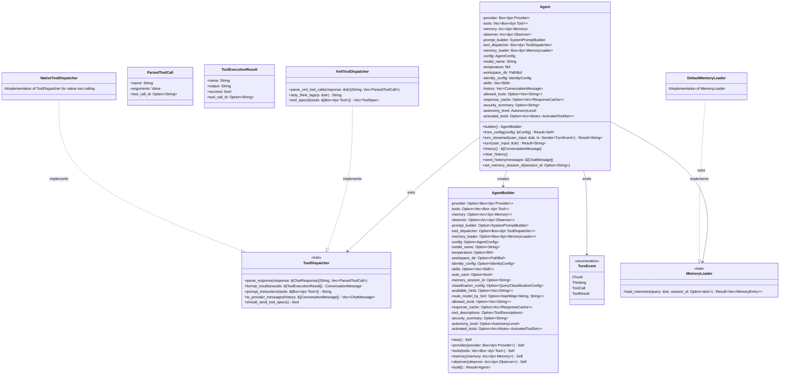
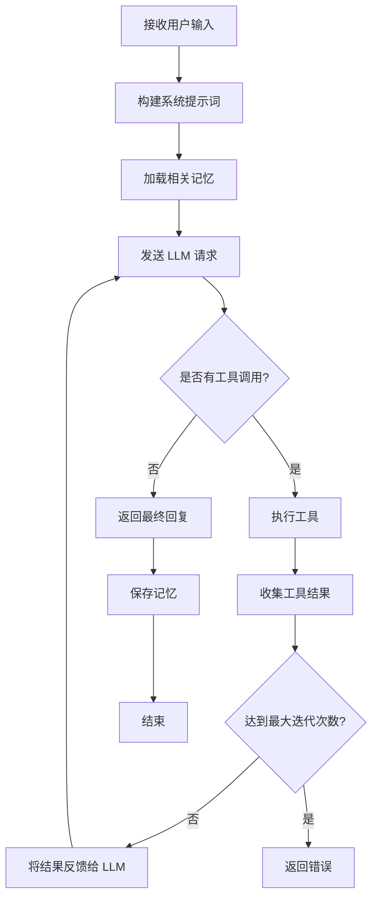
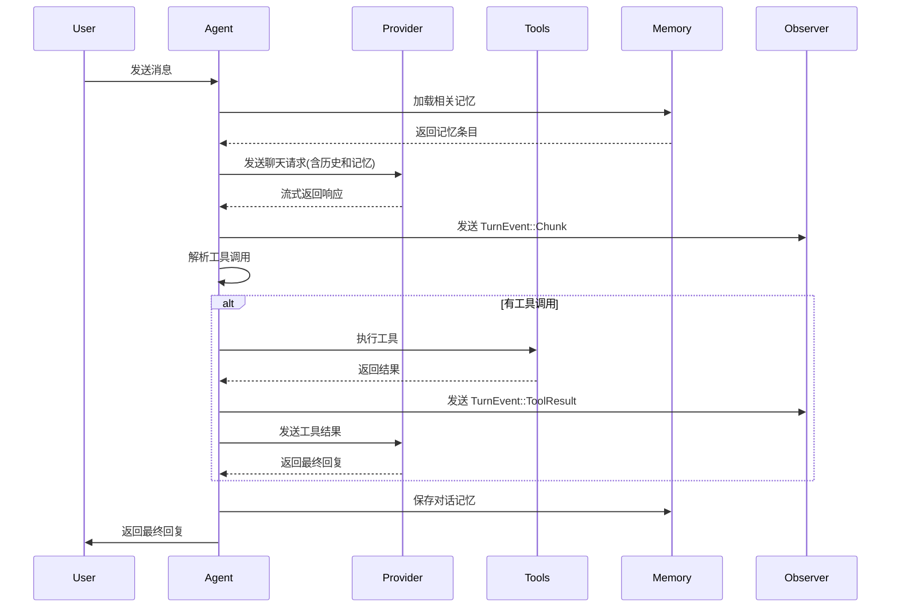
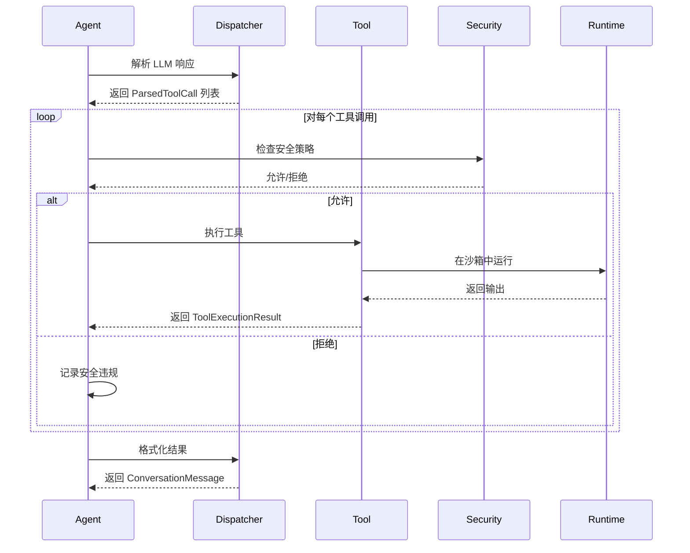

# Agent 模块设计文档

## 1. 模块概述

Agent 模块是 ZeroClaw 的核心组件,负责实现 AI 代理的完整生命周期管理。

### 1.1 核心职责

- LLM 交互: 管理与各种 AI 提供商的通信
- 工具调度: 解析 LLM 响应中的工具调用请求并执行对应工具
- 记忆管理: 加载和存储长期记忆
- 对话历史: 维护多轮对话上下文
- 流式处理: 支持实时流式输出
- 成本控制: 跟踪 token 使用和成本消耗
- 安全策略: 集成安全策略检查

## 2. 架构设计

### 2.1 类图



### 2.2 模块结构

```
src/agent/
├── mod.rs                  # 模块导出
├── agent.rs                # Agent 核心实现
├── loop_.rs                # Agent 主循环逻辑
├── dispatcher.rs           # 工具调用分发器
├── prompt.rs               # 系统提示词构建器
├── classifier.rs           # 查询分类器
├── context_analyzer.rs     # 上下文分析器
├── context_compressor.rs   # 上下文压缩器
├── history.rs              # 对话历史管理
├── history_pruner.rs       # 历史裁剪器
├── loop_detector.rs        # 循环检测器
├── memory_loader.rs        # 记忆加载器
├── personality.rs          # 个性配置
├── thinking.rs             # 思考过程处理
├── tool_execution.rs       # 工具执行引擎
├── cost.rs                 # 成本追踪
├── eval.rs                 # 评估模块
└── tests.rs                # 单元测试
```

## 3. 核心组件详解

### 3.1 Agent 核心类

#### 3.1.1 主要字段说明

| 字段 | 类型 | 说明 |
|------|------|------|
| provider | Box&lt;dyn Provider&gt; | LLM 提供商接口,支持多种后端 |
| tools | Vec&lt;Box&lt;dyn Tool&gt;&gt; | 可用工具集合 |
| memory | Arc&lt;dyn Memory&gt; | 记忆后端,支持 SQLite/Markdown/Qdrant |
| observer | Arc&lt;dyn Observer&gt; | 可观测性接口,用于日志和监控 |
| tool_dispatcher | Box&lt;dyn ToolDispatcher&gt; | 工具调用解析和格式化 |
| history | Vec&lt;ConversationMessage&gt; | 当前会话的对话历史 |
| autonomy_level | AutonomyLevel | 自主级别,控制安全约束 |

#### 3.1.2 关键方法

**from_config(config: &Config) -> Result<Self>**

从配置文件初始化 Agent,这是最常用的构造方式:

1. 创建观察者(observability backend)
2. 创建运行时适配器(native/docker)
3. 创建安全策略(SecurityPolicy)
4. 创建记忆后端(Memory)
5. 初始化工具集(包含所有内置工具和 MCP 工具)
6. 创建 Provider(根据配置的默认提供商)
7. 使用 Builder 模式构建 Agent 实例

**turn_streamed(user_input: &str, tx: Sender&lt;TurnEvent&gt;) -> Result<String>**

执行单轮对话并流式返回结果,流程如下:

1. 构建系统提示词(包含身份、技能、工具描述、安全策略等)
2. 加载相关记忆(基于查询的相关性检索)
3. 发送 LLM 请求(流式模式)
4. 实时解析响应中的文本块和推理内容
5. 检测并解析工具调用(XML 或原生格式)
6. 执行工具并收集结果
7. 如有工具调用,将结果反馈给 LLM 继续下一轮
8. 保存记忆到持久化存储(如启用 auto_save)
9. 返回最终回复文本

**seed_history(messages: &[ChatMessage])**

从会话后端加载历史消息,用于恢复之前的对话上下文:

- 如果历史为空,先添加系统提示词
- 过滤掉种子消息中的 system 角色消息(避免重复)
- 追加所有非系统消息到当前历史

### 3.2 工具分发器 (ToolDispatcher)

工具分发器负责解析 LLM 响应中的工具调用,并将执行结果格式化回 LLM 可理解的格式。

#### 3.2.1 两种实现对比

| 特性 | XmlToolDispatcher | NativeToolDispatcher |
|------|-------------------|---------------------|
| 工具调用格式 | JSON 包裹在特殊标签中 | Provider 原生工具调用 API |
| 适用场景 | 不支持 function calling 的模型 | 支持原生工具调用的模型 |
| 工具规范发送 | 否(在提示词中描述) | 是(通过 API 发送) |
| 推理内容处理 | 移除 think 标签 | 保留 reasoning_content |

#### 3.2.2 XML 工具调用解析流程

XML 工具调用使用特殊标记包裹 JSON,解析步骤:

1. 查找开始标记
2. 提取中间的 JSON 字符串
3. 反序列化为 ParsedToolCall 结构
4. 收集所有工具调用
5. 返回纯文本内容和工具调用列表

#### 3.2.3 Think 标签处理

对于支持推理的模型(如 Qwen),会输出 think 标签包含推理过程:

- strip_think_tags 函数会移除所有 think 标签及其内容
- 确保最终输出的文本不包含内部推理过程
- 保留正常的工具调用和回复内容

### 3.3 Agent 主循环 (loop_.rs)

主循环负责协调整个对话流程,包括多轮工具调用。

#### 3.3.1 主要流程



#### 3.3.2 关键特性

- **最大迭代次数限制**: 防止无限工具调用循环(默认 10 次)
- **成本跟踪**: 实时监控 token 使用和成本消耗
- **历史裁剪**: 当上下文过长时自动裁剪历史记录
- **循环检测**: 检测并阻止重复的工具调用模式
- **模型切换**: 支持在工具执行过程中动态切换模型
- **审批机制**: 对敏感工具调用进行人工审批

### 3.4 记忆加载器 (MemoryLoader)

记忆加载器负责在对话开始前检索相关的长期记忆。

#### 3.4.1 加载策略

1. **关键词匹配**: 从用户输入中提取关键词
2. **向量搜索**: 使用嵌入向量进行语义相似度搜索
3. **时间衰减**: 较旧的记忆权重降低
4. **重要性评分**: 优先加载高重要性的记忆
5. **类别过滤**: 根据配置只加载特定类别的记忆

#### 3.4.2 记忆注入

加载的记忆会被注入到系统提示词中,让 LLM 了解相关背景信息:

- 核心记忆(Core): 用户偏好、身份信息
- 日常记忆(Daily): 最近的活动和事件
- 对话记忆(Conversation): 历史对话摘要
- 自定义类别: 用户定义的特定领域知识

### 3.5 对话历史管理 (history.rs)

#### 3.5.1 历史裁剪策略

当对话历史超过上下文窗口时,采用以下策略:

1. **紧急裁剪**: 保留系统提示词和最近的几条消息
2. **快速裁剪**: 优先裁剪工具结果,保留用户和助手消息
3. **智能裁剪**: 基于 token 估算,平衡保留重要信息

#### 3.5.2 Token 估算

- 使用简化的启发式算法估算 token 数量
- 考虑不同模型的 tokenization 差异
- 预留缓冲空间防止超出限制

### 3.6 成本追踪 (cost.rs)

#### 3.6.1 成本计算

- 跟踪每个 LLM 调用的输入/输出 token 数
- 根据模型定价计算实际成本
- 累计整个会话的成本消耗

#### 3.6.2 预算控制

- 设置每轮对话的成本上限
- 设置总工具循环的成本上限
- 超出预算时停止工具调用并返回警告

### 3.7 循环检测 (loop_detector.rs)

#### 3.7.1 检测策略

检测以下循环模式:

1. **相同工具重复调用**: 同一工具被连续调用多次
2. **相同参数重复**: 工具调用参数完全相同
3. **振荡模式**: 在几个工具之间来回切换

#### 3.7.2 应对措施

- 记录循环检测事件到观察者
- 向 LLM 发出警告,要求其改变策略
- 在严重情况下强制终止循环

## 4. 数据流

### 4.1 典型对话流程



### 4.2 工具调用流程



## 5. 扩展点

### 5.1 自定义 Provider

实现 `Provider` trait 可以添加新的 LLM 提供商:

- chat 方法: 发送聊天请求
- chat_stream 方法: 流式聊天
- models 方法: 列出可用模型

### 5.2 自定义 Tool

实现 `Tool` trait 可以添加新工具:

- name 方法: 工具名称
- spec 方法: 工具规范(JSON Schema)
- execute 方法: 执行逻辑

### 5.3 自定义 Memory

实现 `Memory` trait 可以添加新的记忆后端:

- save 方法: 保存记忆
- load 方法: 加载记忆
- search 方法: 搜索记忆
- stats 方法: 统计信息

### 5.4 自定义 Observer

实现 `Observer` trait 可以添加可观测性后端:

- observe 方法: 接收事件
- flush 方法: 刷新缓冲区

## 6. 配置选项

### 6.1 Agent 配置

```toml
[agent]
max_tool_iterations = 10      # 最大工具迭代次数
auto_save_memories = true     # 自动保存记忆
min_message_chars_for_save = 20  # 最小消息长度(字符)
context_window_tokens = 128000   # 上下文窗口大小
max_history_tokens = 100000      # 最大历史 token 数
```

### 6.2 记忆配置

```toml
[memory]
backend = "sqlite"            # 记忆后端: sqlite/markdown/qdrant/none
policy.consolidation.enabled = true  # 启用记忆整合
policy.decay.enabled = true          # 启用记忆衰减
```

## 7. 测试策略

### 7.1 单元测试

- 工具分发器解析逻辑
- 历史裁剪算法
- Token 估算准确性
- 循环检测逻辑

### 7.2 集成测试

- 完整的对话流程
- 多轮工具调用
- 记忆加载和保存
- 成本跟踪准确性

### 7.3 性能测试

- 大上下文下的响应时间
- 内存使用情况
- 并发对话处理能力

## 8. 最佳实践

### 8.1 开发指南

1. **遵循 Builder 模式**: 使用 AgentBuilder 创建 Agent 实例
2. **合理使用流式**: 对于长时间运行的操作,使用 turn_streamed
3. **注意内存管理**: 及时清理不需要的历史消息
4. **监控成本**: 定期检查成本跟踪数据
5. **测试边界情况**: 特别是空输入、超长输入等

### 8.2 调试技巧

1. **启用详细日志**: 设置 RUST_LOG=debug
2. **检查 Observer 事件**: 观察 TurnEvent 流
3. **验证工具调用**: 检查 ParsedToolCall 是否正确解析
4. **监控循环检测**: 查看是否有循环警告

## 9. 常见问题

### 9.1 工具调用不被识别

- 检查是否使用了正确的 ToolDispatcher
- 验证 LLM 是否正确理解工具调用格式
- 查看日志中的解析错误信息

### 9.2 上下文窗口溢出

- 调整 max_history_tokens 配置
- 检查历史裁剪是否正常工作
- 考虑使用更小的模型或增加裁剪频率

### 9.3 记忆未加载

- 验证记忆后端配置正确
- 检查记忆是否已保存到后端
- 确认查询关键词与记忆内容匹配

## 10. 未来改进方向

1. **更好的循环检测**: 使用机器学习检测复杂循环模式
2. **自适应历史裁剪**: 基于内容重要性智能裁剪
3. **多代理协作**: 支持多个 Agent 协同工作
4. **增量记忆更新**: 更高效地更新现有记忆
5. **缓存优化**: 缓存常见的工具调用结果
