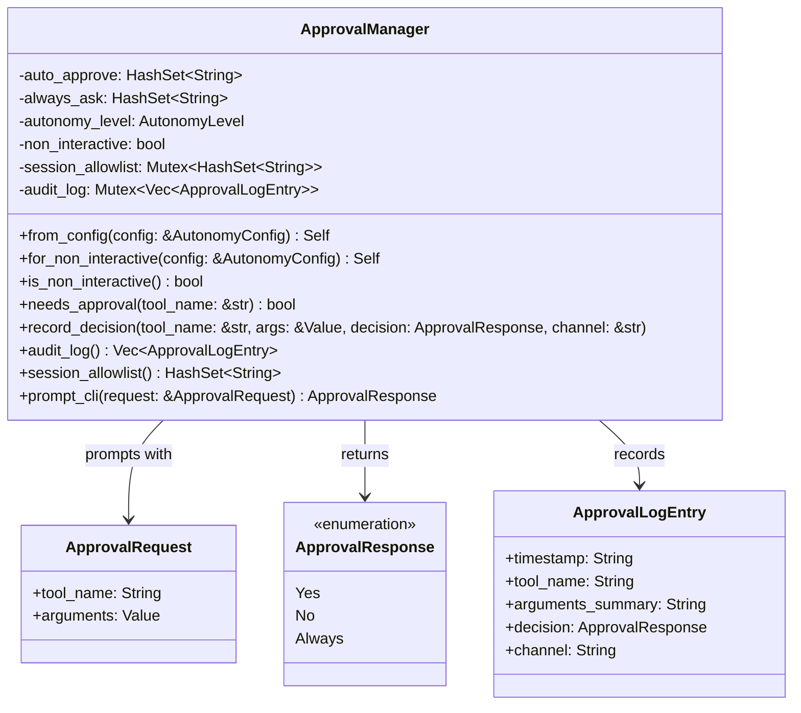
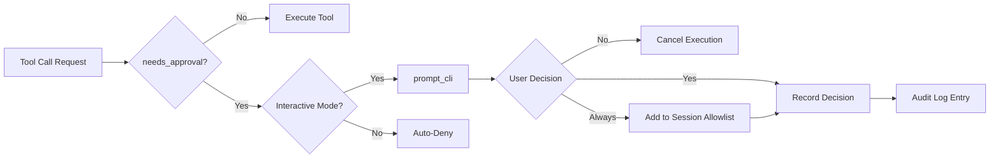
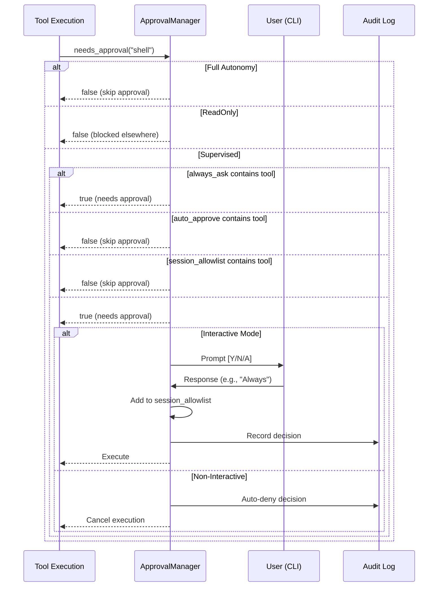

# Approval 模块设计文档

## 1. 模块概述

Approval 模块为零爪系统提供交互式审批工作流,主要用于监督模式下的工具调用前置审批。该模块实现了会话级的"始终允许"白名单和审计日志功能,确保敏感操作得到用户确认。

### 1.1 核心职责

- **工具调用审批**: 在执行工具前提示用户确认
- **会话白名单管理**: 维护会话级的"Always"允许列表
- **审计日志记录**: 记录所有审批决策的完整审计轨迹
- **双模式支持**: 支持交互式(CLI)和非交互式(频道驱动)两种运行模式
- **策略执行**: 强制执行 auto_approve/always_ask 配置策略

## 2. 架构设计

### 2.1 类图



### 2.2 数据流图



## 3. 核心流程

### 3.1 审批决策流程



### 3.2 参数摘要生成

Approval 模块使用智能参数摘要算法,将复杂的 JSON 参数转换为人类可读的简短描述:

1. **对象类型参数**: 提取键值对,格式化为 `key: value` 形式
2. **长值截断**: 超过 80 字符的值会被截断并添加省略号
3. **Unicode 安全**: 使用字符级别的截断,避免破坏多字节字符
4. **非对象类型**: 直接转换为字符串表示

示例:
```json
{"command": "ls -la", "cwd": "/tmp"}
```
转换为:
```
command: ls -la, cwd: /tmp
```

## 4. 关键设计决策

### 4.1 双模式架构

**交互式模式 (CLI)**:
- 通过 stdin/stderr 与用户交互
- 支持实时审批决策
- 适用于本地开发和调试场景

**非交互式模式 (Channels)**:
- 自动拒绝需要审批的工具调用
- 仍然执行 auto_approve/always_ask 策略
- 适用于 Telegram、Discord 等频道驱动场景
- Shell 工具在非交互模式下有特殊处理逻辑

### 4.2 优先级层次

审批决策遵循严格的优先级顺序:

1. **Full Autonomy**: 从不提示,所有工具自动执行
2. **ReadOnly**: 从不提示,但执行被其他层阻止
3. **always_ask**: 总是提示,覆盖会话白名单
4. **auto_approve**: 自动批准,跳过提示
5. **Session Allowlist**: 会话级白名单(来自之前的"Always"决策)
6. **Default**: 监督模式下默认需要审批

### 4.3 线程安全设计

使用 `parking_lot::Mutex` 保护共享状态:
- `session_allowlist`: 会话级白名单,支持并发读写
- `audit_log`: 审计日志,支持并发追加

选择 `parking_lot::Mutex` 而非标准库 `Mutex` 的原因:
- 更小的内存占用
- 更好的性能(自旋锁优化)
- 防止毒化问题

## 5. 扩展点

### 5.1 自定义审批策略

可以通过扩展 `AutonomyConfig` 添加新的审批规则:

```rust
pub struct CustomApprovalStrategy {
    pub risk_threshold: f64,
    pub time_based_rules: Vec<TimeRule>,
}
```

### 5.2 审计日志后端

当前审计日志存储在内存中,可以扩展为:
- SQLite 持久化存储
- 远程日志服务集成
- 实时审计事件推送

## 6. 最佳实践

### 6.1 配置建议

```toml
[autonomy]
level = "supervised"
auto_approve = ["file_read", "memory_recall", "weather"]
always_ask = ["shell", "file_write", "http_request"]
```

### 6.2 安全考虑

1. **敏感工具始终询问**: 将高风险工具(如 shell、文件写入)加入 always_ask
2. **定期审查审计日志**: 监控异常审批模式
3. **会话隔离**: 每个会话有独立的白名单,防止权限泄露
4. **非交互式保守策略**: 频道模式下默认拒绝,避免意外执行

### 6.3 性能优化

1. **HashSet 查找**: O(1) 时间复杂度的工具名称匹配
2. **懒加载审计日志**: 仅在需要时序列化
3. **参数摘要缓存**: 避免重复计算相同参数的摘要

## 7. 测试覆盖

模块包含全面的单元测试,覆盖:
- 自动批准工具的跳过逻辑
- always_ask 工具的强制提示
- 会话白名单的添加和查询
- 审计日志的完整性
- 非交互式模式的自动拒绝
- 参数摘要的正确性
- Unicode 安全截断
- Serde 序列化/反序列化

## 8. 故障排除

### 8.1 常见问题

**问题**: 工具在非交互模式下被拒绝
**解决**: 检查工具是否在 auto_approve 列表中,或调整 autonomy level

**问题**: "Always" 决策未生效
**解决**: 确认工具不在 always_ask 列表中(always_ask 优先级更高)

**问题**: 审计日志丢失
**解决**: 内存中的审计日志在进程重启后会丢失,考虑实现持久化存储

## 9. 相关模块

- **Agent 模块**: 调用 ApprovalManager 进行工具执行前检查
- **Config 模块**: 提供 AutonomyConfig 配置
- **Security 模块**: 定义 AutonomyLevel 枚举
- **Tools 模块**: 触发审批请求的工具执行器
