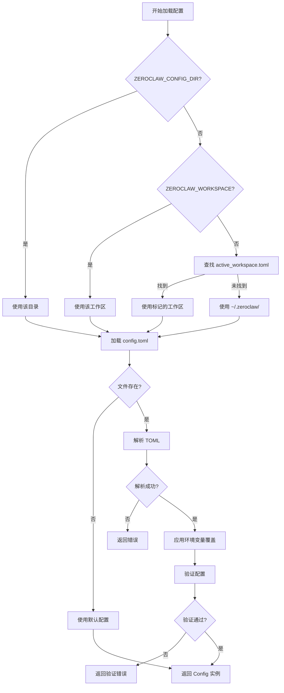

# Config 模块设计文档

## 1. 模块概述

Config 模块负责 ZeroClaw 的配置管理,包括配置文件的加载、解析、验证和持久化。该模块提供类型安全的配置访问,支持多环境配置、环境变量覆盖和动态配置更新。

### 1.1 核心职责

- **配置加载**: 从 TOML 文件加载配置,支持多位置搜索
- **配置验证**: 验证配置值的合法性和完整性
- **环境变量覆盖**: 支持通过环境变量覆盖配置文件中的值
- **工作区管理**: 支持多工作区配置隔离
- **默认值管理**: 提供合理的默认配置值
- **Schema 生成**: 自动生成 JSON Schema 用于配置校验和 IDE 支持

## 2. 架构设计

### 2.1 类图

```mermaid
classDiagram
    class Config {
        +workspace_dir: PathBuf
        +config_path: PathBuf
        +api_key: Option~String~
        +api_url: Option~String~
        +default_provider: Option~String~
        +default_model: Option~String~
        +model_providers: HashMap~String, ModelProviderConfig~
        +default_temperature: f64
        +provider_timeout_secs: u64
        +observability: ObservabilityConfig
        +autonomy: AutonomyConfig
        +trust: TrustConfig
        +security: SecurityConfig
        +runtime: RuntimeConfig
        +reliability: ReliabilityConfig
        +agent: AgentConfig
        +skills: SkillsConfig
        +memory: MemoryConfig
        +storage: StorageConfig
        +gateway: GatewayConfig
        +channels_config: ChannelsConfig
        +cron: CronConfig
        +heartbeat: HeartbeatConfig
        +browser: BrowserConfig
        +web_search: WebSearchConfig
        +composio: ComposioConfig
        +secrets: SecretsConfig
        +cost: CostConfig
        +peripherals: PeripheralsConfig
        +mcp: McpConfig
        +nodes: NodesConfig
        +workspace: WorkspaceConfig
        +plugins: PluginsConfig
        +locale: Option~String~
        
        +load() Result~Self~
        +load_from(path: &Path) Result~Self~
        +save(&self) Result~()~
        +to_json_schema() String
    }

    class AgentConfig {
        +max_tool_iterations: usize
        +auto_save_memories: bool
        +min_message_chars_for_save: usize
        +context_window_tokens: usize
        +max_history_tokens: usize
        +thinking_budget_tokens: Option~usize~
        +stream_mode: StreamMode
        +draft_update_interval_ms: u64
        +interrupt_on_new_message: bool
        +tool_filter_groups: Vec~ToolFilterGroup~
    }

    class MemoryConfig {
        +backend: String
        +path: Option~PathBuf~
        +policy: MemoryPolicyConfig
        +embeddings: EmbeddingRouteConfig
    }

    class GatewayConfig {
        +host: String
        +port: u16
        +require_pairing: bool
        +pairing_code: Option~String~
        +rate_limit_per_minute: u32
        +allow_public_bind: bool
        +tls_cert: Option~PathBuf~
        +tls_key: Option~PathBuf~
    }

    class ChannelsConfig {
        +telegram: Option~TelegramConfig~
        +discord: Option~DiscordConfig~
        +slack: Option~SlackConfig~
        +whatsapp: Option~WhatsAppConfig~
        +matrix: Option~MatrixConfig~
        +lark: Option~LarkConfig~
        +feishu: Option~FeishuConfig~
        +wecom: Option~WeComConfig~
        +imessage: Option~IMessageConfig~
        +email: Option~EmailChannelConfig~
        +nextcloud_talk: Option~NextcloudTalkConfig~
    }

    class TelegramConfig {
        +bot_token: String
        +allowed_users: Vec~String~
        +stream_mode: StreamMode
        +draft_update_interval_ms: u64
        +interrupt_on_new_message: bool
        +mention_only: bool
        +ack_reactions: Option~Vec~String~~
        +proxy_url: Option~String~
    }

    class DiscordConfig {
        +bot_token: String
        +guild_id: Option~String~
        +allowed_users: Vec~String~
        +listen_to_bots: bool
        +interrupt_on_new_message: bool
        +mention_only: bool
        +proxy_url: Option~String~
        +stream_mode: StreamMode
        +draft_update_interval_ms: u64
        +multi_message_delay_ms: u64
        +stall_timeout_secs: u64
    }

    class ChannelConfig {
        <<trait>>
        +name() &'static str
        +desc() &'static str
    }

    class ModelProviderConfig {
        +provider_type: String
        +api_key: Option~String~
        +api_url: Option~String~
        +models: Vec~String~
        +default_model: Option~String~
        +timeout_secs: Option~u64~
        +extra_headers: HashMap~String, String~
    }

    class SecurityConfig {
        +sandbox: SandboxConfig
        +estop: EstopConfig
        +otp: OtpConfig
        +audit: AuditConfig
        +prompt_guard: PromptGuardConfig
        +domain_matcher: DomainMatcher
        +vulnerability_scanning: bool
    }

    class RuntimeConfig {
        +adapter: String
        +docker: DockerRuntimeConfig
        +native: NativeRuntimeConfig
    }

    Config --> AgentConfig : contains
    Config --> MemoryConfig : contains
    Config --> GatewayConfig : contains
    Config --> ChannelsConfig : contains
    Config --> SecurityConfig : contains
    Config --> RuntimeConfig : contains
    Config --> ModelProviderConfig : contains
    TelegramConfig ..|> ChannelConfig : implements
    DiscordConfig ..|> ChannelConfig : implements
```



### 2.2 模块结构

```
src/config/
├── mod.rs                  # 模块导出和重新导出
├── schema.rs               # 配置 Schema 定义(16000+ 行)
├── traits.rs               # 配置相关 trait 定义
└── workspace.rs            # 工作区管理
```

## 3. 核心组件详解

### 3.1 Config 主结构

#### 3.1.1 配置层次结构

Config 采用扁平化的顶层结构,所有子配置都作为直接字段:

**顶层配置分类**:

1. **核心配置**: api_key, default_provider, default_model, default_temperature
2. **提供商配置**: model_providers (多个命名提供商配置)
3. **Agent 配置**: agent (代理行为控制)
4. **记忆配置**: memory, storage (数据持久化)
5. **通信配置**: channels_config, gateway (外部通信)
6. **安全配置**: security, autonomy, secrets (安全和权限)
7. **工具配置**: browser, web_search, composio, mcp (工具集成)
8. **调度配置**: cron, heartbeat (定时任务)
9. **硬件配置**: peripherals, nodes (硬件集成)
10. **扩展配置**: plugins, skills (插件和技能)
11. **可观测性**: observability, cost (监控和成本)

#### 3.1.2 特殊字段处理

**workspace_dir 和 config_path**:

- 使用 `#[serde(skip)]` 标记,不序列化到 TOML
- 在加载时根据以下优先级计算:
  1. ZEROCLAW_WORKSPACE 环境变量
  2. active_workspace.toml 标记文件
  3. 默认 ~/.zeroclaw/

**model_providers**:

- HashMap 结构,支持多个命名提供商配置
- 允许为不同用途配置不同的 API key 和模型
- 与 default_provider/default_model 配合使用

### 3.2 配置加载流程

#### 3.2.1 加载顺序



#### 3.2.2 环境变量覆盖

支持的环境变量覆盖:

| 环境变量 | 覆盖字段 | 说明 |
|---------|---------|------|
| ZEROCLAW_API_KEY | api_key | API 密钥 |
| API_KEY | api_key | 备选 API 密钥 |
| ZEROCLAW_LOCALE | locale | 语言环境 |
| LANG | locale | 系统语言(备选) |
| LC_ALL | locale | 系统语言(备选) |
| RUST_LOG | - | 日志级别 |
| ZEROCLAW_INTERACTIVE | - | 强制交互模式 |

#### 3.2.3 默认值策略

使用 serde 的 `default` 属性和自定义默认函数:

```rust
#[serde(default = "default_temperature")]
pub default_temperature: f64,

fn default_temperature() -> f64 {
    0.7
}
```

### 3.3 通道配置 Trait

#### 3.3.1 ChannelConfig Trait

所有通道配置必须实现此 trait:

```rust
pub trait ChannelConfig {
    fn name() -> &'static str;  // 人类可读的名称
    fn desc() -> &'static str;  // 简短描述
}
```

**实现示例**:

```rust
impl ChannelConfig for TelegramConfig {
    fn name() -> &'static str {
        "telegram"
    }
    
    fn desc() -> &'static str {
        "Telegram bot channel"
    }
}
```

**用途**:

- 统一的通道识别
- 配置验证时的类型检查
- CLI 命令中的通道名称映射

### 3.4 工作区管理

#### 3.4.1 工作区概念

工作区是 ZeroClaw 的独立配置和数据隔离单元:

- 每个工作区有独立的 config.toml
- 独立的记忆数据库(SQLite/Markdown)
- 独立的技能目录
- 独立的会话历史

#### 3.4.2 工作区切换

通过 active_workspace.toml 文件管理:

```toml
# ~/.zeroclaw/active_workspace.toml
active = "work"
```

工作区目录结构:

```
~/.zeroclaw/
├── active_workspace.toml
├── work/
│   ├── config.toml
│   ├── memories/
│   ├── skills/
│   └── sessions/
└── personal/
    ├── config.toml
    ├── memories/
    ├── skills/
    └── sessions/
```

### 3.5 配置验证

#### 3.5.1 验证规则

**温度值验证**:

```rust
pub fn validate_temperature(t: f64) -> Result<f64, String> {
    if t < 0.0 || t > 2.0 {
        Err("Temperature must be between 0.0 and 2.0".to_string())
    } else {
        Ok(t)
    }
}
```

**端口号验证**:

- 必须在 0-65535 范围内
- 0 表示随机可用端口
- 绑定到 0.0.0.0 需要 allow_public_bind=true

**API Key 验证**:

- 非空检查
- 格式验证(针对特定提供商)

#### 3.5.2 跨字段验证

某些配置项之间存在依赖关系:

- gateway.allow_public_bind=false 时,host 不能为 0.0.0.0
- memory.backend="qdrant" 时,必须配置 qdrant.url
- tunnel.enabled=true 时,必须配置 tunnel.provider

### 3.6 JSON Schema 生成

#### 3.6.1 Schema 用途

- IDE 自动补全和验证(vscode-json-languageservice)
- 配置文件的语法检查
- 文档生成
- 配置迁移工具

#### 3.6.2 生成方式

使用 schemars crate 的 JsonSchema derive:

```rust
#[derive(Debug, Clone, Serialize, Deserialize, JsonSchema)]
pub struct Config {
    // ...
}
```

生成命令:

```bash
zeroclaw config schema > schema.json
```

#### 3.6.3 Schema 特性

- 完整的字段描述(doc comments)
- 类型约束(minimum, maximum, pattern)
- 枚举值限制
- 必填/可选字段标记
- 默认值标注

## 4. 主要配置段详解

### 4.1 Agent 配置

```toml
[agent]
max_tool_iterations = 10              # 最大工具调用迭代次数
auto_save_memories = true             # 自动保存对话到记忆
min_message_chars_for_save = 20       # 最小消息长度(字符)
context_window_tokens = 128000        # 上下文窗口大小
max_history_tokens = 100000           # 最大历史 token 数
thinking_budget_tokens = 8000         # 推理 token 预算(可选)
stream_mode = "full"                  # 流式模式: full/draft/off
draft_update_interval_ms = 1000       # 草稿更新间隔
interrupt_on_new_message = false      # 新消息中断当前响应
```

**tool_filter_groups**:

动态控制 MCP 工具的可见性:

```toml
[[agent.tool_filter_groups]]
name = "always_active"
mode = "always"
tools = ["mcp_github_*"]

[[agent.tool_filter_groups]]
name = "contextual"
mode = "dynamic"
tools = ["mcp_jira_*", "mcp_confluence_*"]
keywords = ["jira", "ticket", "confluence", "wiki"]
```

### 4.2 记忆配置

```toml
[memory]
backend = "sqlite"                    # sqlite/markdown/qdrant/none
path = "~/.zeroclaw/memories.db"      # SQLite 数据库路径

[memory.policy]
consolidation.enabled = true          # 启用记忆整合
consolidation.interval_hours = 24     # 整合间隔
decay.enabled = true                  # 启用记忆衰减
decay.half_life_days = 30             # 半衰期(天)
importance.threshold = 0.3            # 重要性阈值

[memory.embeddings]
provider = "openai"                   # 嵌入提供商
model = "text-embedding-3-small"      # 嵌入模型
dimension = 1536                      # 向量维度
```

### 4.3 Gateway 配置

```toml
[gateway]
host = "127.0.0.1"                    # 绑定地址
port = 8080                           # 监听端口
require_pairing = true                # 需要配对码
rate_limit_per_minute = 60            # 速率限制
allow_public_bind = false             # 允许绑定到 0.0.0.0
tls_cert = null                       # TLS 证书路径
tls_key = null                        # TLS 私钥路径
```

### 4.4 通道配置

#### 4.4.1 Telegram

```toml
[channels_config.telegram]
bot_token = "YOUR_BOT_TOKEN"
allowed_users = ["username1", "username2"]
stream_mode = "full"
draft_update_interval_ms = 1000
interrupt_on_new_message = false
mention_only = false
ack_reactions = ["👍", "✅"]
proxy_url = null
```

#### 4.4.2 Discord

```toml
[channels_config.discord]
bot_token = "YOUR_BOT_TOKEN"
guild_id = "123456789"
allowed_users = []
listen_to_bots = false
stream_mode = "full"
draft_update_interval_ms = 1000
multi_message_delay_ms = 800
stall_timeout_secs = 300
```

### 4.5 安全配置

```toml
[security]
sandbox.enabled = true                # 启用沙箱
sandbox.backend = "bubblewrap"        # bubblewrap/firejail/docker

[security.estop]
enabled = true                        # 启用紧急停止
method = "kill-all"                   # kill-all/network-kill/domain-block/tool-freeze
otp.enabled = true                    # 需要 OTP 恢复
otp.method = "totp"                   # totp/hotp

[security.prompt_guard]
enabled = true                        # 启用提示词注入检测
sensitivity = "medium"                # low/medium/high
```

### 4.6 运行时配置

```toml
[runtime]
adapter = "native"                    # native/docker

[runtime.docker]
image = "zeroclaw/zeroclaw:latest"
network_mode = "bridge"
volume_mounts = []
resource_limits =