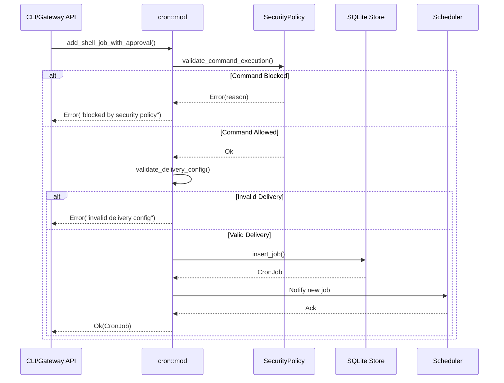
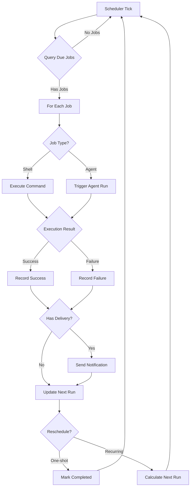
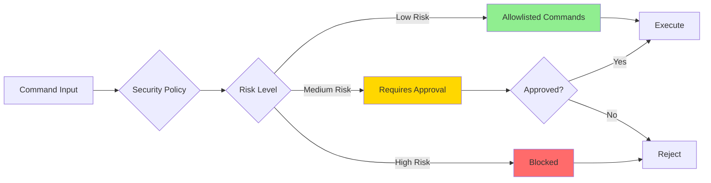

# Cron 模块设计文档

## 1. 模块概述

Cron 模块为零爪系统提供定时任务调度能力,支持类 cron 表达式、一次性任务、周期性任务等多种调度模式。该模块集成了安全策略验证、交付配置、Agent 任务执行等功能,是系统自动化能力的核心组件。

### 1.1 核心职责

- **任务调度**: 支持 cron 表达式、绝对时间、周期性间隔等多种调度方式
- **任务类型**: 支持 Shell 命令执行和 Agent 提示词触发两种任务类型
- **安全验证**: 集成 SecurityPolicy 对 Shell 命令进行严格的安全检查
- **持久化存储**: 使用 SQLite 存储任务定义和执行历史
- **交付配置**: 支持任务执行结果通过 Telegram、Discord 等频道发送
- **声明式同步**: 支持从配置文件声明式定义任务并自动同步

## 2. 架构设计

### 2.1 类图

```mermaid
classDiagram
    class CronJob {
        +id: String
        +name: Option~String~
        +schedule: Schedule
        +job_type: JobType
        +command: String
        +prompt: Option~String~
        +delivery: Option~DeliveryConfig~
        +enabled: bool
        +next_run: DateTime~Utc~
        +last_run: Option~DateTime~Utc~~
        +last_status: Option~String~
        +allowed_tools: Option~Vec~String~~
        +session_target: SessionTarget
    }

    class Schedule {
        <<enumeration>>
        Cron { expr: String, tz: Option~String~ }
        At { at: DateTime~Utc~ }
        Every { every_ms: u64 }
    }

    class JobType {
        <<enumeration>>
        Shell
        Agent
    }

    class DeliveryConfig {
        +mode: String
        +channel: Option~String~
        +to: Option~String~
    }

    class CronJobPatch {
        +schedule: Option~Schedule~
        +command: Option~String~
        +name: Option~String~
        +enabled: Option~bool~
        +allowed_tools: Option~Vec~String~~
    }

    class CronRun {
        +id: String
        +job_id: String
        +started_at: DateTime~Utc~
        +finished_at: Option~DateTime~Utc~~
        +status: String
        +output: Option~String~
        +error: Option~String~
    }

    CronJob --> Schedule : has
    CronJob --> JobType : has
    CronJob --> DeliveryConfig : optional
    CronJob --> CronRun : generates
    CronJobPatch ..> CronJob : updates
```

### 2.2 模块结构

```
cron/
├── mod.rs          # 主模块,公共 API 和 CLI 处理
├── schedule.rs     # 调度表达式解析和验证
├── store.rs        # SQLite 存储层
├── types.rs        # 核心数据类型定义
└── scheduler.rs    # 调度器引擎(后台运行)
```

## 3. 核心流程

### 3.1 任务创建流程(带安全验证)



### 3.2 调度器执行流程



### 3.3 安全验证层次



## 4. 关键设计决策

### 4.1 双路径任务类型

**Shell 任务**:
- 直接执行系统命令
- 严格的安全策略验证
- 适用于运维自动化、监控等场景
- 需要明确的审批才能创建中等风险命令

**Agent 任务**:
- 触发 Agent 执行自然语言提示词
- 绕过 Shell 安全验证(因为不直接执行命令)
- 适用于智能巡检、数据分析等场景
- 支持限定可用工具列表(allowed_tools)

### 4.2 安全优先设计

所有 Shell 命令创建/更新入口都经过统一的安全验证:

```rust
// 强制使用带审批的创建函数
pub fn add_shell_job_with_approval(
    config: &Config,
    name: Option<String>,
    schedule: Schedule,
    command: &str,
    delivery: Option<DeliveryConfig>,
    approved: bool,  // 显式审批标志
) -> Result<CronJob>
```

**CLI 默认行为**: `approved = false`,中等风险命令被拒绝
**Gateway API**: 需要显式传递审批标志
**Scheduler**: 使用已存储的任务,不再次验证(假设创建时已验证)

### 4.3 时区支持

Cron 表达式支持可选的时区配置:

```toml
[[cron_jobs]]
expression = "0 9 * * *"
tz = "America/Los_Angeles"
command = "echo 'Good morning'"
```

实现细节:
- 使用 `chrono-tz` crate 进行时区转换
- 存储时使用 UTC,显示时转换为本地时区
- 更新表达式时保留原有时区,除非显式指定新时区

### 4.4 交付配置验证

严格的交付配置验证确保消息能正确送达:

```rust
pub(crate) fn validate_delivery_config(delivery: Option<&DeliveryConfig>) -> Result<()> {
    // 1. mode 必须是 "none" 或 "announce"
    // 2. announce 模式必须指定 channel
    // 3. channel 必须是支持的类型(telegram, discord, slack 等)
    // 4. 必须指定接收者(to 字段)
}
```

## 5. 数据模型

### 5.1 Schedule 枚举

```rust
pub enum Schedule {
    /// Standard cron expression with optional timezone
    Cron { 
        expr: String,      // e.g., "*/5 * * * *"
        tz: Option<String> // e.g., "Asia/Shanghai"
    },
    /// One-shot execution at absolute time
    At { 
        at: DateTime<Utc> 
    },
    /// Repeating interval in milliseconds
    Every { 
        every_ms: u64 
    },
}
```

### 5.2 JobType 枚举

```rust
pub enum JobType {
    /// Execute a shell command
    Shell,
    /// Trigger an agent run with a prompt
    Agent,
}
```

### 5.3 SessionTarget 枚举(Agent 任务专用)

```rust
pub enum SessionTarget {
    /// Create a new isolated session for this run
    Isolated,
    /// Use the main/default session
    Main,
    /// Target a specific session by ID
    Session(String),
}
```

## 6. 扩展点

### 6.1 自定义调度策略

可以通过实现新的 `Schedule` 变体支持更多调度模式:

```rust
pub enum Schedule {
    // ... existing variants ...
    /// Business hours only (Mon-Fri, 9am-5pm)
    BusinessHours { tz: String },
    /// Exponential backoff retry
    RetryBackoff { 
        base_interval_ms: u64,
        max_retries: u32 
    },
}
```

### 6.2 自定义交付渠道

扩展 `validate_delivery_config` 支持新的通知渠道:

```rust
match channel.to_ascii_lowercase().as_str() {
    "telegram" | "discord" | "slack" | "mattermost" | 
    "signal" | "matrix" | "qq" | "wechat" => {}  // Add wechat
    other => bail!("unsupported delivery channel: {other}"),
}
```

### 6.3 任务执行钩子

在任务执行前后添加钩子:

```rust
pub trait CronJobHook {
    async fn before_execute(&self, job: &CronJob) -> Result<()>;
    async fn after_execute(&self, job: &CronJob, result: &CronRun);
}
```

## 7. 最佳实践

### 7.1 安全配置

```toml
[autonomy]
level = "supervised"
allowed_commands = ["echo", "ls", "date", "uptime"]

[cron]
require_explicit_approval = true  # 默认拒绝中等风险命令
```

### 7.2 任务命名规范

```toml
[[cron_jobs]]
name = "daily-backup"           # 清晰描述用途
expression = "0 2 * * *"        # 每天凌晨 2 点
command = "./scripts/backup.sh"

[[cron_jobs]]
name = "health-check-every-5min"
every_ms = 300000               # 每 5 分钟
command = "curl -f http://localhost:8080/health"
```

### 7.3 交付配置示例

```toml
[[cron_jobs]]
name = "morning-report"
expression = "0 8 * * 1-5"      # 工作日早上 8 点
command = "zeroclaw agent -m 'Generate daily summary'"

[cron_jobs.delivery]
mode = "announce"
channel = "telegram"
to = "@team-channel"
```

### 7.4 Agent 任务最佳实践

```toml
[[cron_jobs]]
name = "server-health-monitor"
expression = "*/15 * * * *"     # 每 15 分钟
job_type = "agent"              # Agent 任务
prompt = """
Check server health:
1. Disk space usage
2. Memory utilization  
3. CPU load average
4. Running processes count

Report any issues found.
"""
allowed_tools = ["shell", "file_read", "memory_store"]
session_target = "isolated"     # 隔离会话,避免干扰主对话
```

## 8. 故障排除

### 8.1 常见问题

**问题**: Shell 命令被拒绝
**解决**: 
- 检查命令是否在 `allowed_commands` 列表中
- 使用 `--approved` 标志显式批准(仅 CLI)
- 降低 autonomy level 或调整安全策略

**问题**: Cron 任务未按时执行
**解决**:
- 检查 `enabled` 字段是否为 true
- 验证 cron 表达式语法正确性
- 查看 scheduler 日志确认任务被加载
- 检查时区配置是否正确

**问题**: 交付消息未发送
**解决**:
- 验证 delivery.channel 是否配置且启用
- 检查 delivery.to 是否指定有效的接收者
- 确认频道连接正常(查看 daemon 状态)

### 8.2 调试技巧

```bash
# 列出所有任务
zeroclaw cron list

# 查看任务执行历史
zeroclaw cron runs <job-id>

# 暂停/恢复任务
zeroclaw cron pause <job-id>
zeroclaw cron resume <job-id>

# 删除任务
zeroclaw cron remove <job-id>
```

## 9. 性能考虑

### 9.1 调度器优化

- **懒加载**: 仅在需要时计算下次运行时间
- **批量查询**: 一次查询所有到期任务,减少数据库访问
- **内存缓存**: 缓存活跃任务的 next_run 时间

### 9.2 数据库索引

```sql
CREATE INDEX idx_cron_jobs_enabled ON cron_jobs(enabled);
CREATE INDEX idx_cron_jobs_next_run ON cron_jobs(next_run);
CREATE INDEX idx_cron_runs_job_id ON cron_runs(job_id);
```

### 9.3 资源限制

- **最大并发任务数**: 防止资源耗尽
- **任务执行超时**: 默认 300 秒,可配置
- **历史记录的 TTL**: 定期清理旧执行记录

## 10. 相关模块

- **Security 模块**: 提供命令执行的安全策略验证
- **Agent 模块**: 执行 Agent 类型的 cron 任务
- **Channels 模块**: 处理任务结果的交付通知
- **Daemon 模块**: 运行后台调度器
- **Gateway 模块**: 提供 Cron REST API
