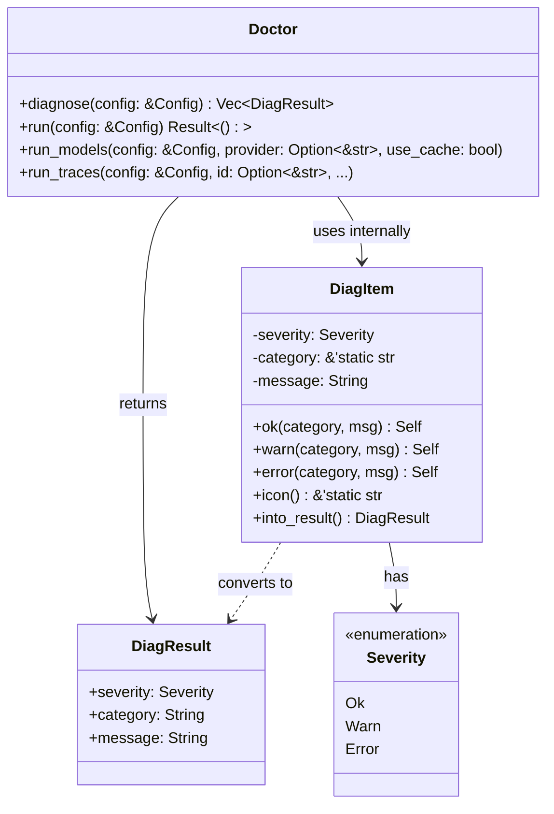
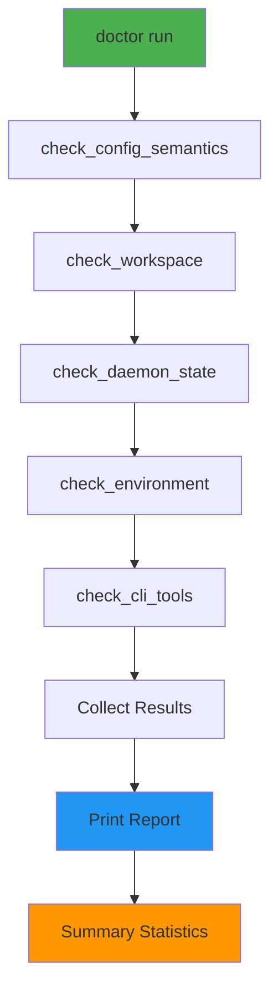
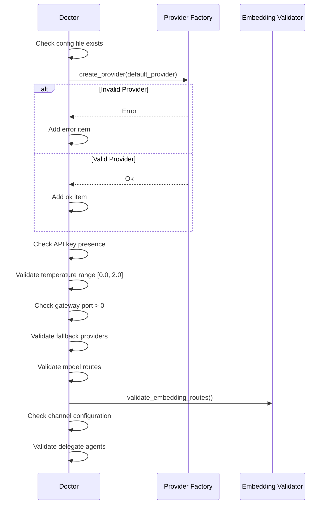
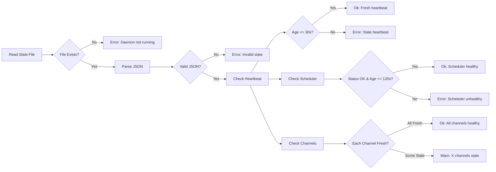

# Doctor 模块设计文档

## 1. 模块概述

Doctor 模块是零爪系统的诊断工具,提供全面的系统健康检查能力。它验证配置完整性、工作区状态、守护进程运行情况、环境依赖等,帮助快速定位和解决问题。

### 1.1 核心职责

- **配置语义验证**: 检查 provider、API key、model、temperature 等配置的合法性
- **工作区完整性**: 验证目录存在性、可写性、磁盘空间、关键文件
- **守护进程状态**: 检查心跳 freshness、组件健康度、通道连接状态
- **环境依赖检查**: 验证 git、shell、curl 等必需工具可用性
- **模型连通性测试**: 探测各 Provider 的 API 可达性和模型列表
- **运行时追踪**: 查看和分析 runtime trace 事件

## 2. 架构设计

### 2.1 类图



### 2.2 诊断类别

```
config          - 配置文件语义验证
workspace       - 工作区完整性和权限
daemon          - 守护进程和组件状态
environment     - 系统环境变量和工具
cli-tools       - 发现的 CLI 工具列表
models          - Provider 模型连通性
traces          - 运行时追踪事件
```

## 3. 核心流程

### 3.1 诊断执行流程



### 3.2 配置验证详细流程



### 3.3 守护进程状态检查



## 4. 关键特性

### 4.1 严重程度分级

**Ok (✅)**: 检查通过,系统正常
**Warn (⚠️)**: 潜在问题,建议关注但不影响运行
**Error (❌)**: 严重问题,需要立即修复

### 4.2 模型连通性探测

`doctor models` 命令支持:

1. **Provider 级别探测**: 测试特定或所有 Provider 的 API 连通性
2. **缓存策略**: 使用 `--cache` 复用之前的结果,`--force` 强制刷新
3. **错误分类**:
   - **Skipped**: Provider 不支持实时模型发现
   - **Auth/Access**: API key 无效或套餐限制
   - **Error**: 网络或其他错误
4. **连通性矩阵**: 以表格形式展示所有 Provider 的状态

示例输出:
```
🩺 ZeroClaw Doctor — Model Catalog Probe
  Providers to probe: 3
  Mode: cache-first

  [openrouter]
    ✅ model catalog check passed

  [anthropic]
    ⚠️  auth/access: 401 Unauthorized

  [ollama]
    ✅ model catalog check passed

  Summary: 2 ok, 0 skipped, 1 auth/access, 0 errors

  Connectivity matrix:
  provider           status       models   detail
  ------------------ ------------ -------- ------
  openrouter         ok           1523     catalog refreshed
  anthropic          auth/access  -        401 Unauthorized
  ollama             ok           45       catalog refreshed
```

### 4.3 运行时追踪分析

`doctor traces` 命令支持:

1. **按 ID 查询**: `--id <trace-id>` 查看完整事件载荷
2. **过滤查询**: `--event <type>` 和 `--contains <text>` 组合过滤
3. **限制数量**: `--limit <n>` 控制返回事件数(默认最新 50 条)
4. **成功/失败标记**: 直观显示每个事件的执行结果

示例输出:
```
Runtime traces (newest first)
Path: /path/to/runtime_trace.jsonl
Filters: event=* contains=* limit=10

- 2024-01-15T10:30:00Z | abc123 | tool_call | ok | shell command executed
- 2024-01-15T10:29:55Z | def456 | llm_call | fail | timeout after 30s
- 2024-01-15T10:29:50Z | ghi789 | memory_store | ok | stored 3 memories
```

## 5. 扩展点

### 5.1 添加新的诊断检查

```rust
fn check_custom_feature(config: &Config, items: &mut Vec<DiagItem>) {
    let cat = "custom-feature";
    
    if some_condition {
        items.push(DiagItem::ok(cat, "feature is working"));
    } else {
        items.push(DiagItem::error(cat, "feature is broken"));
    }
}

// 在 diagnose() 中调用
pub fn diagnose(config: &Config) -> Vec<DiagResult> {
    let mut items: Vec<DiagItem> = Vec::new();
    check_config_semantics(config, &mut items);
    check_workspace(config, &mut items);
    check_custom_feature(config, &mut items);  // Add here
    // ...
}
```

### 5.2 自定义诊断输出格式

当前支持:
- **Human-readable**: 带 emoji 的控制台输出
- **JSON**: 结构化数据,适合 Web Dashboard 消费

可以扩展为:
- **Prometheus metrics**: 导出为监控指标
- **Sentry events**: 自动上报错误

## 6. 最佳实践

### 6.1 定期健康检查

```bash
# 每日定时检查
zeroclaw doctor > /var/log/zeroclaw/doctor-$(date +%Y%m%d).log

# CI/CD 集成
if ! zeroclaw doctor | grep -q "0 errors"; then
    echo "Health check failed!"
    exit 1
fi
```

### 6.2 故障排查流程

1. **运行基础诊断**: `zeroclaw doctor`
2. **检查模型连通性**: `zeroclaw doctor models`
3. **查看运行时追踪**: `zeroclaw doctor traces --limit 20`
4. **检查特定事件**: `zeroclaw doctor traces --id <trace-id>`

### 6.3 配置验证清单

在修改配置后运行:
```bash
# 验证配置语法
zeroclaw config validate

# 验证配置语义
zeroclaw doctor

# 测试模型连通性
zeroclaw doctor models --provider openrouter
```

## 7. 性能考虑

### 7.1 诊断优化

- **并行检查**: 环境检查和 CLI 工具检查可以并行
- **超时控制**: 模型探测设置合理超时(默认 10s)
- **缓存策略**: 模型探测结果缓存,避免频繁 API 调用

### 7.2 资源使用

- **内存**: 诊断过程峰值内存 < 50MB
- **CPU**: CPU 密集型操作少,主要是 I/O 等待
- **网络**: 模型探测可能产生多个 API 请求

## 8. 相关模块

- **Config 模块**: 提供配置验证所需的数据结构
- **Providers 模块**: 用于 Provider 创建和模型探测
- **Daemon 模块**: 提供守护进程状态文件
- **Observability 模块**: 提供运行时追踪数据
- **Gateway 模块**: Doctor API 端点供 Web Dashboard 使用
