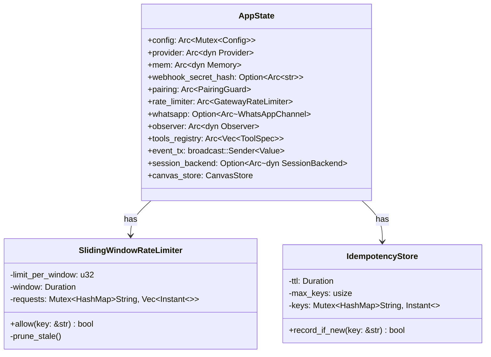
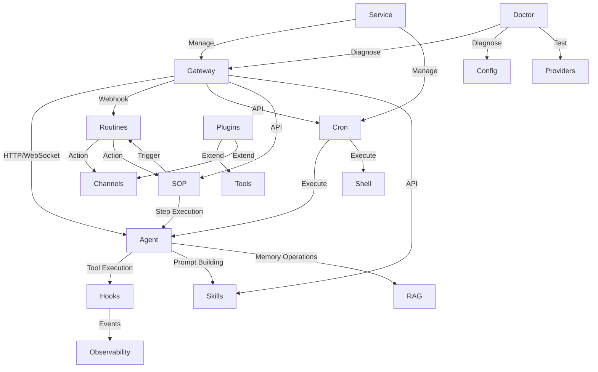

# Gateway、Hooks、Observability 等模块设计文档

本文档涵盖零爪系统的多个辅助但重要的模块,包括 Gateway(HTTP 网关)、Hooks(事件钩子)、Observability(可观测性)、Plugins(插件系统)、RAG(检索增强生成)、Routines(例程自动化)、Service(服务管理)、Skills(技能系统)和 SOP(标准作业程序)。

---

## 1. Gateway 模块

### 1.1 概述

Gateway 是基于 Axum 的 HTTP/WebSocket 网关,提供 REST API、Web Dashboard、WebSocket 聊天、Webhook 接收等功能。

### 1.2 核心职责

- **HTTP 服务器**: 基于 Axum 的高性能 HTTP/1.1 合规服务器
- **REST API**: 提供配置管理、任务调度、记忆查询等 API 端点
- **WebSocket**: 支持实时双向通信(agent chat、node discovery)
- **Webhook 处理**: 接收 WhatsApp、Telegram、Linq 等渠道的 webhook
- **安全认证**: Pairing code、Bearer token、WebAuthn 硬件密钥认证
- **速率限制**: Sliding window 算法防止滥用
- **SSE 广播**: Server-Sent Events 实时事件推送
- **静态文件**: 托管 Web Dashboard 前端资源

### 1.3 架构设计



### 1.4 关键路由

```
GET  /health                    - 健康检查
GET  /metrics                   - Prometheus 指标
POST /pair                      - 设备配对
POST /webhook                   - 通用 webhook
POST /whatsapp                  - WhatsApp webhook
POST /linq                      - Linq (iMessage) webhook
GET  /ws/chat                   - WebSocket agent chat
GET  /ws/nodes                  - WebSocket node discovery
GET  /api/status                - 系统状态
GET  /api/config                - 获取配置
PUT  /api/config                - 更新配置
GET  /api/tools                 - 工具列表
GET  /api/cron                  - Cron 任务列表
POST /api/cron                  - 创建 Cron 任务
GET  /api/memory                - 记忆列表
POST /api/memory                - 存储记忆
GET  /api/sessions              - 会话列表
GET  /api/canvas/{id}           - Live Canvas (A2UI)
POST /api/webauthn/register/start - WebAuthn 注册
```

### 1.5 安全特性

**速率限制**:
- Pairing: 默认 5 次/分钟/IP
- Webhook: 默认 60 次/分钟/IP
- Sliding window 算法,自动清理过期记录

**请求限制**:
- Body size: 64KB (config PUT: 1MB)
- Timeout: 30s (可通过 `ZEROCLAW_GATEWAY_TIMEOUT_SECS` 环境变量调整)

**认证方式**:
1. **Pairing Code**: 一次性配对码,用于初始设备授权
2. **Bearer Token**: 长期有效的 API token
3. **Webhook Secret**: HMAC-SHA256 签名验证
4. **WebAuthn**: FIDO2 硬件密钥认证(可选)

---

## 2. Hooks 模块

### 2.1 概述

Hooks 模块提供事件驱动的扩展机制,允许在系统关键生命周期节点插入自定义逻辑。

### 2.2 核心职责

- **事件拦截**: 在 LLM 调用、工具执行、消息收发等关键点触发钩子
- **数据修改**: 支持修改 prompt、messages、tool args 等数据
- **流程控制**: 支持取消操作(如阻止危险的 tool call)
- **优先级调度**: 按优先级顺序执行 modifying hooks
- **并行执行**: Void hooks 并行执行,提高性能

### 2.3 Hook 类型

**Void Hooks (并行,无返回值)**:
```rust
async fn on_gateway_start(&self, host: &str, port: u16)
async fn on_session_start(&self, session_id: &str, channel: &str)
async fn on_llm_input(&self, messages: &[ChatMessage], model: &str)
async fn on_after_tool_call(&self, tool: &str, result: &ToolResult, duration: Duration)
async fn on_message_sent(&self, channel: &str, recipient: &str, content: &str)
```

**Modifying Hooks (串行,可修改数据或取消)**:
```rust
async fn before_model_resolve(&self, provider: String, model: String) 
    -> HookResult<(String, String)>
    
async fn before_prompt_build(&self, prompt: String) 
    -> HookResult<String>
    
async fn before_tool_call(&self, name: String, args: Value) 
    -> HookResult<(String, Value)>
    
async fn on_message_received(&self, message: ChannelMessage) 
    -> HookResult<ChannelMessage>
```

### 2.4 HookResult 枚举

```rust
pub enum HookResult<T> {
    Continue(T),   // 继续执行,可能已修改数据
    Cancel(String), // 取消操作,返回原因
}
```

### 2.5 使用示例

```rust
// 实现自定义 hook
struct SecurityHook;

#[async_trait]
impl HookHandler for SecurityHook {
    fn name(&self) -> &str { "security-check" }
    fn priority(&self) -> i32 { 100 }  // 高优先级
    
    async fn before_tool_call(&self, name: String, args: Value) 
        -> HookResult<(String, Value)> 
    {
        if name == "shell" {
            let cmd = args.get("command").and_then(|v| v.as_str());
            if let Some(cmd) = cmd {
                if cmd.contains("rm -rf") {
                    return HookResult::Cancel("Dangerous command blocked".into());
                }
            }
        }
        HookResult::Continue((name, args))
    }
}

// 注册 hook
let mut runner = HookRunner::new();
runner.register(Box::new(SecurityHook));
```

---

## 3. Observability 模块

### 3.1 概述

Observability 模块提供统一的可观测性后端抽象,支持多种监控和追踪后端。

### 3.2 支持的后端

```rust
pub fn create_observer(config: &ObservabilityConfig) -> Box<dyn Observer> {
    match config.backend.as_str() {
        "log" => Box::new(LogObserver::new()),
        "verbose" => Box::new(VerboseObserver::new()),
        "prometheus" => Box::new(PrometheusObserver::new()),
        "otel" | "opentelemetry" | "otlp" => Box::new(OtelObserver::new(...)),
        "none" | "noop" => Box::new(NoopObserver),
        _ => Box::new(NoopObserver),
    }
}
```

### 3.3 Observer Trait

```rust
#[async_trait]
pub trait Observer: Send + Sync {
    fn name(&self) -> &str;
    
    async fn observe_event(&self, event: ObserverEvent);
    async fn record_metric(&self, name: &str, value: f64, labels: HashMap<String, String>);
    async fn start_span(&self, operation: &str) -> SpanId;
    async fn end_span(&self, span_id: SpanId, success: bool);
}
```

### 3.4 Runtime Trace

运行时追踪系统记录关键事件的完整上下文:

```rust
pub struct RuntimeTraceEvent {
    pub id: String,
    pub timestamp: String,
    pub event_type: String,  // "llm_call", "tool_call", "memory_operation"
    pub success: Option<bool>,
    pub duration_ms: Option<u64>,
    pub message: Option<String>,
    pub metadata: serde_json::Value,
}
```

**存储模式**:
- **Rolling**: 固定大小的环形缓冲区,自动覆盖旧事件
- **Full**: 追加所有事件到文件,适合调试

**查询命令**:
```bash
zeroclaw doctor traces --limit 20
zeroclaw doctor traces --id <trace-id>
zeroclaw doctor traces --event tool_call --contains shell
```

---

## 4. Plugins 模块

### 4.1 概述

Plugins 模块基于 WASM (Extism) 实现插件系统,允许动态加载自定义工具、渠道、记忆后端等。

### 4.2 插件清单

```toml
# manifest.toml
name = "my-plugin"
version = "0.1.0"
description = "Custom tools for my workflow"
author = "John Doe"
wasm_path = "plugin.wasm"

capabilities = ["tool", "channel"]

permissions = ["http_client", "file_read", "memory_read"]

signature = "base64url-encoded-ed25519-signature"
publisher_key = "hex-encoded-public-key"
```

### 4.3 插件能力

```rust
pub enum PluginCapability {
    Tool,      // 提供自定义工具
    Channel,   // 提供新的通信渠道
    Memory,    // 提供记忆后端
    Observer,  // 提供可观测性后端
}
```

### 4.4 权限系统

```rust
pub enum PluginPermission {
    HttpClient,   // HTTP 请求
    FileRead,     // 文件系统读取
    FileWrite,    // 文件系统写入
    EnvRead,      // 环境变量读取
    MemoryRead,   // 记忆读取
    MemoryWrite,  // 记忆写入
}
```

### 4.5 安全考虑

- **沙箱执行**: WASM 模块在隔离环境中运行
- **签名验证**: 可选的 Ed25519 签名验证
- **权限最小化**: 显式声明所需权限
- **资源限制**: CPU、内存、执行时间限制

---

## 5. RAG 模块

### 5.1 概述

RAG (Retrieval-Augmented Generation) 模块为硬件数据表检索提供支持,帮助 Agent 理解硬件引脚映射和技术规格。

### 5.2 核心功能

**数据表加载**:
- 支持 Markdown、Text、PDF (可选 feature)
- 自动分块(chunking),每块最多 512 tokens
- 从文件名推断开发板标签

**Pin Aliases 解析**:
```markdown
## Pin Aliases
red_led: 13
builtin_led: 13
user_button: 5

# 或表格格式
## Pin Aliases
| alias       | pin |
|-------------|-----|
| red_led     | 13  |
| user_button | 5   |
```

**关键词检索**:
```rust
pub fn retrieve(&self, query: &str, boards: &[String], limit: usize) 
    -> Vec<&DatasheetChunk>
```

**Pin Alias 上下文注入**:
```rust
// 用户说 "turn on red led"
// 自动注入: "nucleo-f401re: red_led = pin 13"
let context = rag.pin_alias_context("red led", &["nucleo-f401re"]);
```

### 5.3 使用场景

```rust
// 加载数据表
let rag = HardwareRag::load(workspace_dir, "datasheets")?;

// 检索相关信息
let boards = vec!["nucleo-f401re".to_string()];
let chunks = rag.retrieve("GPIO pin configuration", &boards, 3);

// 构建 prompt 上下文
let pin_context = rag.pin_alias_context("turn on LED", &boards);
let prompt = format!("{}\n\n{}", pin_context, user_query);
```

---

## 6. Routines 模块

### 6.1 概述

Routines 模块提供轻量级的事件驱动自动化规则,匹配 incoming events 并触发 actions。

### 6.2 配置示例

```toml
[[routines]]
name = "deploy-notify"
description = "Notify Slack on deploy webhook"
cooldown_secs = 60

[[routines.patterns]]
source = "webhook"
pattern = "/api/deploy"
strategy = "exact"  # exact, glob, regex

[routines.action]
type = "message"
channel = "slack-general"
text = "Deploy triggered!"
```

### 6.3 匹配策略

- **Exact**: 完全匹配
- **Glob**: 通配符匹配 (`*`, `?`)
- **Regex**: 正则表达式匹配

### 6.4 Action 类型

- **Message**: 发送消息到指定渠道
- **Shell**: 执行 shell 命令
- **SOP Trigger**: 触发 SOP 执行
- **Cron Job**: 创建一次性 cron 任务

---

## 7. Service 模块

### 7.1 概述

Service 模块提供跨平台的守护进程管理,支持 systemd (Linux)、launchd (macOS)、Task Scheduler (Windows)。

### 7.2 支持的 Init 系统

```rust
pub enum InitSystem {
    Auto,     // 自动检测
    Systemd,  // Linux systemd
    Openrc,   // Linux OpenRC (Alpine)
}
```

### 7.3 命令

```bash
zeroclaw service install     # 安装服务
zeroclaw service start       # 启动服务
zeroclaw service stop        # 停止服务
zeroclaw service restart     # 重启服务
zeroclaw service status      # 查看状态
zeroclaw service uninstall   # 卸载服务
zeroclaw service logs -n 50  # 查看日志
zeroclaw service logs -f     # 跟随日志
```

### 7.4 平台特定实现

**macOS (launchd)**:
- Plist 文件: `~/Library/LaunchAgents/com.zeroclaw.daemon.plist`
- 日志: `~/var/zeroclaw/logs/daemon.{stdout,stderr}.log`
- Homebrew 集成: 检测 Homebrew 安装路径

**Linux (systemd)**:
- Unit 文件: `~/.config/systemd/user/zeroclaw.service`
- 日志: `journalctl --user -u zeroclaw.service`
- 自动重启: `Restart=always`

**Linux (OpenRC)**:
- Init 脚本: `/etc/init.d/zeroclaw`
- 日志: `/var/log/zeroclaw/error.log`
- 系统用户: 创建 `zeroclaw` 系统用户

**Windows (Task Scheduler)**:
- 任务名称: `ZeroClaw Daemon`
- 日志: `%APPDATA%\zeroclaw\logs\daemon.{stdout,stderr}.log`

---

## 8. Skills 模块

### 8.1 概述

Skills 模块允许用户定义和加载自定义技能,扩展 Agent 的能力。Skills 可以是本地文件或从社区仓库同步。

### 8.2 Skill 格式

**SKILL.toml (完整格式)**:
```toml
[skill]
name = "web-research"
description = "Conduct deep web research on a topic"
version = "0.1.0"
author = "Jane Doe"
tags = ["research", "web"]

[[tools]]
name = "search"
description = "Search the web"
kind = "http"
command = "https://api.search.com/search?q={query}"

[[prompts]]
"""
When researching, always:
1. Search multiple sources
2. Cross-reference facts
3. Cite your sources
"""
```

**SKILL.md (简化格式)**:
```markdown
---
name: quick-note
description: Take quick notes
version: 0.1.0
tags: [productivity]
---

# Quick Note Skill

When the user wants to take a note:
1. Extract key points
2. Format as markdown
3. Store in memory with tags
```

### 8.3 Open Skills 集成

从社区仓库自动同步 skills:

```toml
[skills]
open_skills_enabled = true
open_skills_dir = "~/.zeroclaw/open-skills"  # 可选,默认 ~/open-skills
allow_scripts = false  # 安全:禁止脚本文件
```

同步机制:
- 首次使用时 `git clone` besoeasy/open-skills
- 每周自动 `git pull` 更新
- 审计安全检查,跳过不安全的 skills

### 8.4 Prompt 注入模式

```rust
pub enum SkillsPromptInjectionMode {
    Full,     // 注入完整 skill 指令和工具元数据
    Compact,  // 仅注入摘要,按需通过 read_skill 工具加载
}
```

### 8.5 Skill 工具转换

Skill 中定义的 tools 可以转换为可调用的 Tool trait 对象:

```rust
pub fn skills_to_tools(
    skills: &[Skill],
    security: Arc<SecurityPolicy>,
) -> Vec<Box<dyn Tool>>
```

支持的 tool kinds:
- **shell/script**: 转换为 `SkillShellTool`
- **http**: 转换为 `SkillHttpTool`

---

## 9. SOP 模块

### 9.1 概述

SOP (Standard Operating Procedure) 模块提供结构化的操作流程定义和执行引擎,适用于需要严格步骤控制的场景。

### 9.2 SOP 结构

**SOP.toml (元数据和触发器)**:
```toml
[sop]
name = "emergency-shutdown"
description = "Safe shutdown procedure for industrial equipment"
version = "1.0.0"
priority = "critical"
execution_mode = "step_by_step"  # auto, supervised, step_by_step, deterministic
cooldown_secs = 300
max_concurrent = 1
deterministic = false

[[triggers]]
type = "manual"

[[triggers]]
type = "mqtt"
topic = "sensors/emergency"
condition = "$.value > 90"

[[triggers]]
type = "peripheral"
board = "nucleo-f401re-0"
signal = "pin_3"
condition = "> 0"
```

**SOP.md (执行步骤)**:
```markdown
# Emergency Shutdown Procedure

## Steps

1. **Check readings** — Read all sensor data and confirm emergency.
   - tools: gpio_read, memory_recall
   - requires_confirmation: true

2. **Close valve** — Set GPIO pin 5 LOW to close safety valve.
   - tools: gpio_write
   - kind: execute

3. **Review** — Human review checkpoint before final shutdown.
   - kind: checkpoint

4. **Shutdown system** — Power down main controller.
   - tools: shell
   - requires_confirmation: true
```

### 9.3 执行模式

- **Auto**: 自动执行所有步骤
- **Supervised**: 每步需要人工确认
- **StepByStep**: 逐步执行,可暂停/恢复
- **Deterministic**: 确定性执行,支持 checkpoint 回滚

### 9.4 Step Kind

```rust
pub enum SopStepKind {
    Execute,     // 普通执行步骤
    Checkpoint,  // 检查点,需要人工审批
}
```

### 9.5 触发器类型

```rust
pub enum SopTrigger {
    Manual,                                    // 手动触发
    Mqtt { topic, condition },                 // MQTT 消息
    Webhook { path },                          // HTTP webhook
    Cron { expression },                       // 定时触发
    Peripheral { board, signal, condition },   // 硬件事件
}
```

### 9.6 验证和审计

```bash
# 列出所有 SOPs
zeroclaw sop list

# 验证 SOP 完整性
zeroclaw sop validate --name emergency-shutdown

# 显示 SOP 详情
zeroclaw sop show --name emergency-shutdown
```

验证检查:
- 名称和描述非空
- 至少有一个触发器
- 至少有一个步骤
- 步骤编号连续
- 步骤标题非空

---

## 10. 模块间关系



---

## 11. 总结

这些模块共同构成了零爪系统的扩展性和可维护性基础:

- **Gateway**: 对外接口层,处理所有 HTTP/WebSocket 通信
- **Hooks**: 事件扩展机制,允许自定义业务逻辑
- **Observability**: 监控和追踪,保障系统可观测性
- **Plugins**: WASM 插件系统,实现安全的动态扩展
- **RAG**: 硬件知识检索,增强 Agent 的领域理解
- **Routines**: 轻量级自动化,快速响应事件
- **Service**: 跨平台服务管理,简化部署运维
- **Skills**: 用户自定义能力,扩展 Agent 技能树
- **SOP**: 结构化流程,确保关键操作的可靠性

每个模块都遵循零爪的核心设计原则:
- **Trait-driven**: 基于 trait 的可扩展架构
- **Security-first**: 默认安全,显式授权
- **Modular**: 松耦合,独立演进
- **Cross-platform**: 支持 macOS、Linux、Windows
