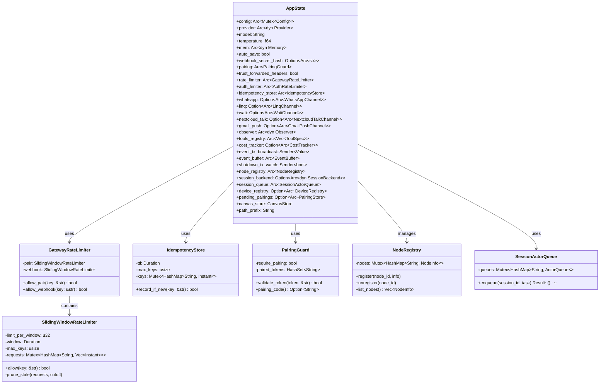
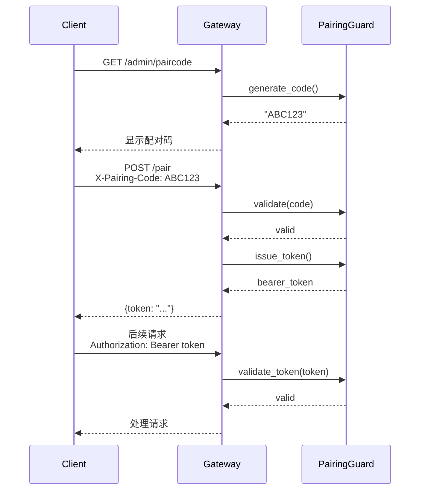
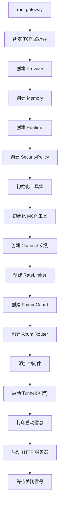

# Gateway 模块设计文档

## 1. 模块概述

Gateway 模块是 ZeroClaw 的 HTTP/WebSocket 网关服务,基于 Axum 框架构建。它提供 REST API、WebSocket 聊天、Webhook 接收、设备配对、实时事件推送等功能,是 ZeroClaw 与外部系统交互的主要入口。

### 1.1 核心职责

- **HTTP 服务器**: 基于 Axum 的 HTTP/1.1 合规服务器
- **REST API**: 配置管理、任务调度、记忆管理、会话管理等 API
- **WebSocket**: 实时双向通信(聊天、节点发现)
- **Webhook 接收**: 接收 WhatsApp、Linq、WATI、Nextcloud Talk、Gmail 等渠道的消息
- **设备配对**: 安全的客户端配对和认证机制
- **速率限制**: 滑动窗口速率限制器防止滥用
- **幂等性**: 请求去重防止重复处理
- **SSE 推送**: Server-Sent Events 实时事件广播
- **静态文件**: Web Dashboard 前端文件服务
- **TLS 支持**: HTTPS 加密通信
- **反向代理**: 支持路径前缀部署

## 2. 架构设计

### 2.1 类图



### 2.2 路由结构

```
/admin/*          # 管理端点(shutdown, paircode)
/health           # 健康检查
/metrics          # Prometheus 指标
/pair             # 设备配对
/webhook          # 通用 webhook
/whatsapp         # WhatsApp webhook
/linq             # Linq webhook
/wati             # WATI webhook
/nextcloud-talk   # Nextcloud Talk webhook
/api/*            # REST API
/ws/chat          # WebSocket 聊天
/ws/nodes         # WebSocket 节点发现
/sse              # Server-Sent Events
/*                # 静态文件(Web Dashboard)
```

## 3. 核心组件详解

### 3.1 安全机制

#### 3.1.1 配对系统 (Pairing)

**工作流程**:



**特性**:
- 一次性配对码(使用后立即失效)
- SHA-256 哈希存储,不存储明文
- 常量时间比较防止时序攻击
- Token 持久化到 SQLite
- 支持多设备配对

#### 3.1.2 速率限制 (Rate Limiting)

**滑动窗口算法**:

```rust
struct SlidingWindowRateLimiter {
    limit_per_window: u32,  // 每窗口限制
    window: Duration,       // 窗口大小(60秒)
    max_keys: usize,        // 最大跟踪的 key 数量
    requests: HashMap<String, Vec<Instant>>,  // key -> 时间戳列表
}
```

**工作流程**:
1. 清理过期时间戳(>60秒前)
2. 检查当前窗口内的请求数
3. 如果 < limit,允许并记录时间戳
4. 如果 >= limit,拒绝

**限流维度**:
- 配对请求: `gateway.pair_rate_limit_per_minute`
- Webhook 请求: `gateway.webhook_rate_limit_per_minute`
- 认证请求: AuthRateLimiter(指数退避)

#### 3.1.3 幂等性 (Idempotency)

防止重复处理相同请求:

```rust
// 客户端发送幂等性 key
POST /api/cron
Idempotency-Key: abc123

// Gateway 检查
if !idempotency_store.record_if_new("abc123") {
    return 409 Conflict;  // 已处理过
}

// 处理请求...
```

**特性**:
- TTL 过期(默认 3600 秒)
- LRU 淘汰(max_keys 限制)
- 定期清理过期 key

### 3.2 WebSocket 支持

#### 3.2.1 聊天 WebSocket (/ws/chat)

**功能**:
- 实时双向聊天
- 会话持久化(可选)
- 串行执行(通过 SessionActorQueue)
- 流式响应

**消息格式**:

```json
// 客户端 -> 服务器
{
  "type": "message",
  "content": "Hello",
  "session_id": "optional_session_id"
}

// 服务器 -> 客户端
{
  "type": "chunk",
  "delta": "Hi there!"
}

{
  "type": "tool_call",
  "name": "shell",
  "args": {"command": "ls"}
}

{
  "type": "complete",
  "session_id": "sess_123"
}
```

#### 3.2.2 节点发现 WebSocket (/ws/nodes)

用于分布式节点注册和发现:

```json
// 节点注册
{
  "type": "register",
  "node_id": "node_1",
  "metadata": {...}
}

// 服务器广播
{
  "type": "node_list",
  "nodes": [...]
}
```

### 3.3 Webhook 处理

#### 3.3.1 通用 Webhook (/webhook)

接收 JSON 消息并转发给 Agent:

```json
POST /webhook
X-Webhook-Secret: your_secret
{
  "message": "Process this request",
  "session_id": "optional"
}
```

**验证**:
- X-Webhook-Secret header(可选)
- 与配置的 `channels_config.webhook.secret` 比较(SHA-256 哈希)

#### 3.3.2 WhatsApp Webhook (/whatsapp)

**GET**: Meta 验证
```
GET /whatsapp?hub.mode=subscribe&hub.challenge=xyz&hub.verify_token=token
```

**POST**: 接收消息
```json
{
  "object": "whatsapp_business_account",
  "entry": [{
    "changes": [{
      "value": {
        "messages": [{
          "from": "1234567890",
          "text": {"body": "Hello"}
        }]
      }
    }]
  }]
}
```

**签名验证**:
- X-Hub-Signature-256 header
- 使用 whatsapp_app_secret 计算 HMAC-SHA256

#### 3.3.3 其他渠道 Webhook

- **Linq** (/linq): iMessage/RCS/SMS
- **WATI** (/wati): WhatsApp Business API
- **Nextcloud Talk** (/nextcloud-talk): 自托管聊天
- **Gmail Push** (/webhook/gmail): Gmail Pub/Sub 通知

每个都有独立的签名验证机制。

### 3.4 REST API

#### 3.4.1 配置管理

```
GET  /api/config          # 获取配置
PUT  /api/config          # 更新配置(需要 1MB body limit)
```

#### 3.4.2 任务调度

```
GET  /api/cron            # 列出任务
POST /api/cron            # 添加任务
GET  /api/cron/{id}       # 获取任务
PATCH /api/cron/{id}      # 更新任务
DELETE /api/cron/{id}     # 删除任务
GET  /api/cron/{id}/runs  # 执行历史
```

#### 3.4.3 记忆管理

```
GET  /api/memory          # 列出记忆
POST /api/memory          # 存储记忆
DELETE /api/memory/{key}  # 删除记忆
```

#### 3.4.4 会话管理

```
GET  /api/sessions              # 列出会话
GET  /api/sessions/running      # 运行中的会话
GET  /api/sessions/{id}/messages # 会话消息
GET  /api/sessions/{id}/state   # 会话状态
DELETE /api/sessions/{id}       # 删除会话
PUT    /api/sessions/{id}       # 重命名会话
```

#### 3.4.5 其他 API

```
GET  /api/status          # 系统状态
GET  /api/tools           # 工具列表
GET  /api/integrations    # 集成列表
GET  /api/doctor          # 诊断检查
GET  /api/cost            # 成本统计
GET  /api/cli-tools       # CLI 工具
GET  /api/health          # 健康详情
```

### 3.5 SSE (Server-Sent Events)

实时事件推送:

```javascript
const eventSource = new EventSource('/sse');
eventSource.onmessage = (event) => {
  const data = JSON.parse(event.data);
  console.log('Event:', data);
};
```

**事件类型**:
- tool_call: 工具调用
- tool_result: 工具结果
- chunk: 文本块
- thinking: 推理内容
- complete: 完成
- error: 错误

**实现**:
- BroadcastObserver: 包装底层 Observer
- EventBuffer: 环形缓冲区(500 条事件)
- 新连接可以回放历史事件

### 3.6 会话队列 (SessionActorQueue)

防止同一会话的并发请求导致状态混乱:

```rust
// 串行化处理
queue.enqueue(session_id, async move {
    // 处理请求
}).await?;
```

**特性**:
- 每会话独立队列
- 最大队列长度(8)
- 超时保护(30秒)
- 空闲清理(600秒)

## 4. 启动流程



## 5. 配置选项

### 5.1 Gateway 配置

```toml
[gateway]
host = "127.0.0.1"              # 绑定地址
port = 8080                     # 端口
require_pairing = true          # 需要配对
allow_public_bind = false       # 允许 0.0.0.0
trust_forwarded_headers = false # 信任 X-Forwarded-For
pair_rate_limit_per_minute = 10 # 配对限流
webhook_rate_limit_per_minute = 60 # webhook 限流
rate_limit_max_keys = 10000     # 最大跟踪 IP 数
idempotency_ttl_secs = 3600     # 幂等性 TTL
idempotency_max_keys = 10000    # 最大幂等性 key 数
session_persistence = true      # 会话持久化
session_ttl_hours = 72          # 会话 TTL
path_prefix = ""                # 反向代理前缀
```

### 5.2 TLS 配置

```toml
[gateway.tls]
enabled = true
cert = "/path/to/cert.pem"
key = "/path/to/key.pem"
```

## 6. 部署场景

### 6.1 本地开发

```bash
zeroclaw gateway start
# http://127.0.0.1:8080
```

### 6.2 Docker 部署

```yaml
version: '3'
services:
  zeroclaw:
    image: zeroclaw/zeroclaw:latest
    ports:
      - "8080:8080"
    environment:
      - ZEROCLAW_CONFIG_DIR=/config
    volumes:
      - ./config:/config
```

### 6.3 反向代理(Nginx)

```nginx
location /zeroclaw/ {
    proxy_pass http://127.0.0.1:8080/;
    proxy_http_version 1.1;
    proxy_set_header Upgrade $http_upgrade;
    proxy_set_header Connection "upgrade";  # WebSocket
}
```

配置:
```toml
[gateway]
path_prefix = "/zeroclaw"
```

### 6.4 公共访问(Tunnel)

```toml
[tunnel]
provider = "cloudflare"  # cloudflare/ngrok/localtunnel
```

启动时自动创建公网 URL。

## 7. 监控和指标

### 7.1 Prometheus 指标

```
GET /metrics

# HTTP 请求
http_requests_total{method, path, status}
http_request_duration_seconds{method, path}

# WebSocket
websocket_connections_active
websocket_messages_total{type}

# 配对
pairing_attempts_total{status}
paired_devices_total

# 速率限制
rate_limit_rejections_total{endpoint}
```

### 7.2 健康检查

```
GET /health

{
  "status": "healthy",
  "components": {
    "gateway": "ok",
    "memory": "ok",
    "provider": "ok"
  }
}
```

Docker HEALTHCHECK:
```dockerfile
HEALTHCHECK --interval=30s --timeout=5s \
  CMD curl -f http://localhost:8080/health || exit 1
```

## 8. 安全最佳实践

1. **启用配对**: `require_pairing = true`
2. **使用 TLS**: 生产环境始终启用 HTTPS
3. **限制公开绑定**: `allow_public_bind = false`
4. **配置 Webhook Secret**: 验证 webhook 来源
5. **设置速率限制**: 防止暴力破解和 DDoS
6. **审查 CORS**: 限制允许的源
7. **定期轮换 Token**: 撤销旧设备
8. **监控审计日志**: 检测异常活动

## 9. 性能优化

1. **连接池**: 复用数据库和 HTTP 连接
2. **缓存**: 工具规范、配置等静态数据
3. **异步处理**: 非阻塞 I/O
4. **限流**: 防止资源耗尽
5. **超时**: 避免慢请求占用资源
6. **压缩**: 启用 gzip/brotli
7. **静态文件**: 使用 CDN 或 Nginx 服务

## 10. 故障排查

### 10.1 常见问题

**无法连接**:
- 检查防火墙规则
- 确认 host/port 配置
- 查看日志中的绑定错误

**配对失败**:
- 验证配对码正确
- 检查时钟同步
- 查看 pairing 日志

**WebSocket 断开**:
- 检查网络稳定性
- 调整超时设置
- 查看 session_queue 日志

**Webhook 未收到**:
- 验证签名正确
- 检查 secret 配置
- 查看 webhook 日志

### 10.2 日志级别

```bash
RUST_LOG=debug zeroclaw gateway start
```

关键日志:
- `gateway`: HTTP 请求/响应
- `pairing`: 配对事件
- `websocket`: WS 连接
- `webhook`: Webhook 接收

## 11. 未来改进方向

1. **GraphQL API**: 更灵活的查询
2. **gRPC 支持**: 高性能内部通信
3. **OAuth2 集成**: 标准认证协议
4. **API 版本控制**: /api/v1, /api/v2
5. **请求追踪**: OpenTelemetry 集成
6. **负载均衡**: 多实例部署
7. **缓存层**: Redis 缓存
8. **速率限制增强**: 令牌桶算法
9. **Webhook 重试**: 失败自动重试
10. **API 文档**: OpenAPI/Swagger
