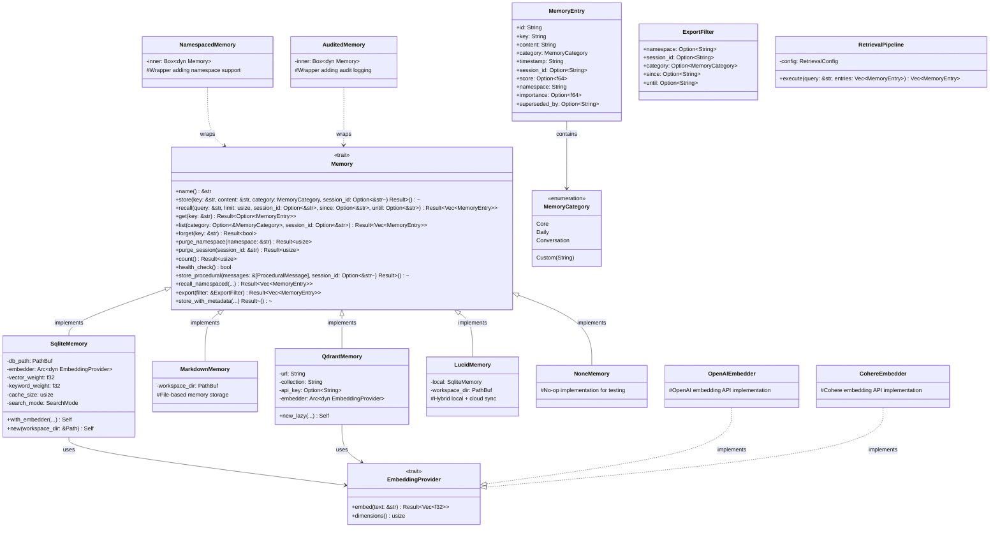
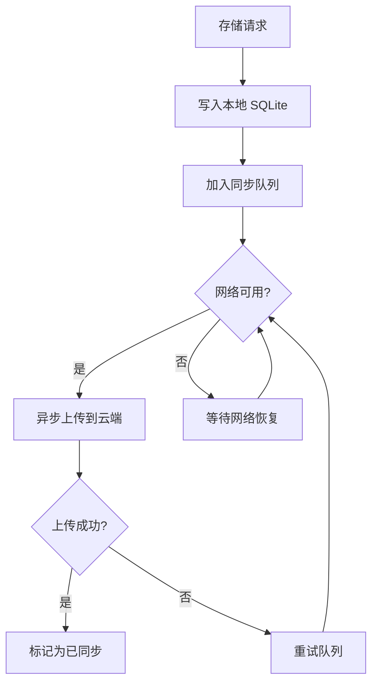
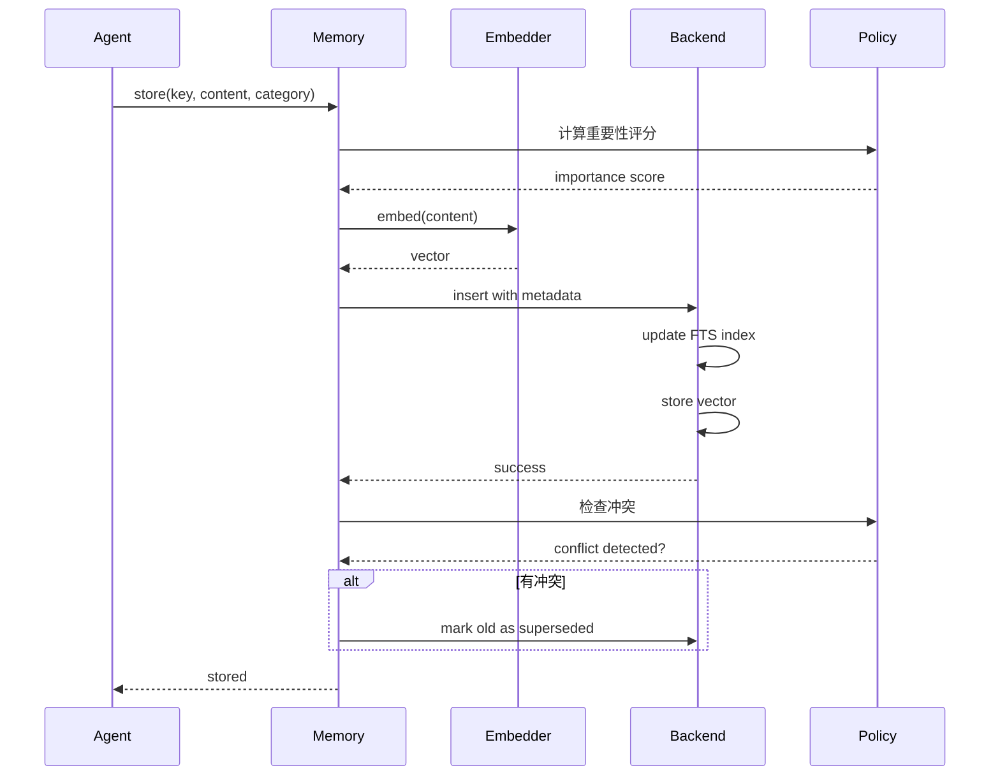
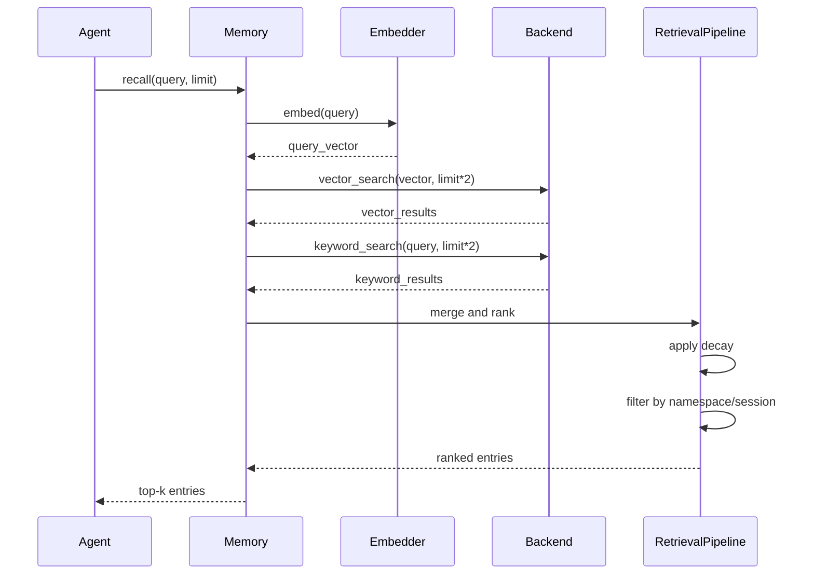

# Memory 模块设计文档

## 1. 模块概述

Memory 模块为 ZeroClaw 提供持久化记忆能力,支持多种后端实现,包括 SQLite、Markdown 文件、Qdrant 向量数据库等。该模块实现了智能记忆检索、重要性评分、时间衰减、冲突解决等高级功能。

### 1.1 核心职责

- **多后端支持**: SQLite、Markdown、Qdrant、Lucid(混合)、None(无记忆)
- **向量搜索**: 基于嵌入向量的语义相似度检索
- **关键词搜索**: 传统的文本匹配检索
- **混合检索**: 结合向量和关键词的加权搜索
- **记忆管理**: 存储、检索、更新、删除记忆条目
- **记忆策略**: 重要性评分、时间衰减、冲突解决、自动整合
- **命名空间隔离**: 支持多 Agent/多会话的记忆隔离
- **GDPR 合规**: 支持数据导出和批量删除

## 2. 架构设计

### 2.1 类图



### 2.2 模块结构

```
src/memory/
├── mod.rs                  # 模块导出和工厂函数
├── traits.rs               # Memory trait 定义
├── backend.rs              # 后端分类和配置
├── sqlite.rs               # SQLite 后端实现
├── markdown.rs             # Markdown 文件后端
├── qdrant.rs               # Qdrant 向量数据库后端
├── lucid.rs                # Lucid 混合后端
├── none.rs                 # No-op 后端
├── namespaced.rs           # 命名空间包装器
├── audit.rs                # 审计日志包装器
├── embeddings.rs           # 嵌入向量提供商
├── retrieval.rs            # 检索管道
├── vector.rs               # 向量搜索工具
├── chunker.rs              # 文本分块
├── importance.rs           # 重要性评分
├── decay.rs                # 时间衰减
├── conflict.rs             # 冲突检测和解决
├── consolidation.rs        # 记忆整合
├── hygiene.rs              # 记忆清理和保留策略
├── snapshot.rs             # 记忆快照和恢复
├── response_cache.rs       # 响应缓存
├── knowledge_graph.rs      # 知识图谱
├── policy.rs               # 记忆策略执行器
├── cli.rs                  # CLI 命令支持
└── battle_tests.rs         # 压力测试
```

## 3. 核心组件详解

### 3.1 Memory Trait

所有记忆后端必须实现的核心接口:

**主要方法**:

- `store`: 存储记忆条目
- `recall`: 根据查询检索相关记忆
- `get`: 通过 key 获取单个记忆
- `list`: 列出所有记忆(可过滤)
- `forget`: 删除单个记忆
- `purge_namespace`: 批量删除命名空间
- `purge_session`: 批量删除会话
- `count`: 统计记忆数量
- `health_check`: 健康检查
- `export`: GDPR 数据导出

**可选方法**(有默认实现):

- `store_procedural`: 存储过程性记忆
- `recall_namespaced`: 命名空间检索
- `store_with_metadata`: 带元数据存储

### 3.2 SQLite 后端 (SqliteMemory)

#### 3.2.1 特性

- 本地文件存储(~/.zeroclaw/memories.db)
- 支持向量搜索(使用 FTS5 和自定义向量索引)
- 混合检索(向量 + 关键词加权)
- 嵌入向量缓存
- 事务支持
- 并发安全

#### 3.2.2 数据库 Schema

```sql
CREATE TABLE memories (
    id TEXT PRIMARY KEY,
    key TEXT NOT NULL,
    content TEXT NOT NULL,
    category TEXT NOT NULL,
    timestamp TEXT NOT NULL,
    session_id TEXT,
    namespace TEXT DEFAULT 'default',
    importance REAL DEFAULT 0.5,
    superseded_by TEXT,
    created_at TEXT DEFAULT CURRENT_TIMESTAMP
);

CREATE VIRTUAL TABLE memories_fts USING fts5(
    key, content, category, namespace
);

CREATE TABLE embeddings (
    memory_id TEXT PRIMARY KEY REFERENCES memories(id),
    vector BLOB NOT NULL,
    dimensions INTEGER NOT NULL
);
```

#### 3.2.3 混合检索算法

```rust
// 伪代码
fn hybrid_search(query: &str, limit: usize) -> Vec<MemoryEntry> {
    // 1. 向量搜索
    let query_vector = embedder.embed(query);
    let vector_results = vector_search(query_vector, limit * 2);
    
    // 2. 关键词搜索
    let keyword_results = fts_search(query, limit * 2);
    
    // 3. 合并结果
    let mut combined = merge_results(vector_results, keyword_results);
    
    // 4. 计算综合分数
    for entry in &mut combined {
        entry.score = Some(
            vector_weight * entry.vector_score.unwrap_or(0.0) +
            keyword_weight * entry.keyword_score.unwrap_or(0.0)
        );
    }
    
    // 5. 按分数排序并返回 top-k
    combined.sort_by(|a, b| b.score.partial_cmp(&a.score).unwrap());
    combined.into_iter().take(limit).collect()
}
```

### 3.3 Markdown 后端 (MarkdownMemory)

#### 3.3.1 存储结构

```
~/.zeroclaw/memories/
├── core.md           # 核心记忆
├── daily.md          # 日常记忆
├── conversation.md   # 对话记忆
└── custom_category.md # 自定义类别
```

#### 3.3.2 文件格式

```markdown
---
id: mem_abc123
key: user_preference_language
category: core
timestamp: 2026-04-06T10:00:00Z
session_id: null
namespace: default
importance: 0.8
---

用户偏好使用 Rust 进行系统编程。

---
```

#### 3.3.3 优缺点

**优点**:
- 人类可读
- 易于版本控制
- 便于手动编辑

**缺点**:
- 不支持向量搜索
- 大规模性能较差
- 并发写入困难

### 3.4 Qdrant 后端 (QdrantMemory)

#### 3.4.1 特性

- 远程向量数据库
- 高性能向量搜索
- 分布式支持
- 丰富的元数据过滤
- 懒加载连接

#### 3.4.2 配置示例

```toml
[memory]
backend = "qdrant"

[memory.qdrant]
url = "http://localhost:6333"
collection = "zeroclaw_memories"
api_key = "optional_api_key"

[memory.embedding_routes]
hint = "semantic"
provider = "openai"
model = "text-embedding-3-small"
dimensions = 1536
```

### 3.5 Lucid 后端 (LucidMemory)

#### 3.5.1 设计理念

Lucid 是混合后端,结合本地 SQLite 和云端同步:

- 本地优先: 所有操作先在本地 SQLite 执行
- 异步同步: 后台线程将变更同步到云端
- 离线可用: 网络中断时仍可正常工作
- 冲突解决: 使用时间戳和重要性评分解决冲突

#### 3.5.2 工作流程



### 3.6 嵌入向量提供商 (Embeddings)

#### 3.6.1 支持的提供商

| 提供商 | 模型 | 维度 | API Key 环境变量 |
|-------|------|------|-----------------|
| OpenAI | text-embedding-3-small | 1536 | OPENAI_API_KEY |
| OpenAI | text-embedding-3-large | 3072 | OPENAI_API_KEY |
| Cohere | embed-english-v3.0 | 1024 | COHERE_API_KEY |
| OpenRouter | 各种嵌入模型 | 可变 | OPENROUTER_API_KEY |
| 自定义 | 自定义端点 | 可配置 | - |

#### 3.6.2 嵌入路由

支持通过 `hint:` 前缀动态选择嵌入模型:

```toml
# 默认嵌入配置
[memory]
embedding_provider = "openai"
embedding_model = "text-embedding-3-small"
embedding_dimensions = 1536

# 嵌入路由
[[embedding_routes]]
hint = "semantic"
provider = "openai"
model = "text-embedding-3-large"
dimensions = 3072

[[embedding_routes]]
hint = "fast"
provider = "cohere"
model = "embed-english-light-v3.0"
dimensions = 384
```

使用时:

```rust
// 使用默认嵌入
memory.store("key", "content", category, None).await?;

// 使用特定路由
memory.store("hint:semantic", "content", category, None).await?;
```

### 3.7 记忆策略

#### 3.7.1 重要性评分 (Importance Scoring)

重要性评分范围 0.0-1.0,基于以下因素:

- **内容长度**: 较长的内容通常更重要
- **关键词密度**: 包含重要关键词
- **用户显式标记**: 用户手动标注的重要性
- **访问频率**: 经常被引用的记忆
- **时间新鲜度**: 最近的记忆权重更高

计算公式:

```
importance = 0.3 * length_score +
             0.3 * keyword_score +
             0.2 * frequency_score +
             0.2 * recency_score
```

#### 3.7.2 时间衰减 (Decay)

记忆的重要性随时间递减,使用指数衰减模型:

```
current_importance = initial_importance * e^(-λ * t)
```

其中:
- λ = ln(2) / half_life_days (衰减常数)
- t = 距离创建时间的天数
- half_life_days = 半衰期(默认 30 天)

配置:

```toml
[memory.policy.decay]
enabled = true
half_life_days = 30
min_importance = 0.1  # 最低重要性阈值
```

#### 3.7.3 冲突检测与解决

当新记忆与现有记忆冲突时:

**检测策略**:
- Key 相同
- 内容语义相似度高(>0.8)
- 同一命名空间和类别

**解决策略**:
1. **时间优先**: 较新的记忆覆盖旧的
2. **重要性优先**: 重要性更高的保留
3. **标记为已取代**: 旧记忆的 `superseded_by` 指向新记忆 ID
4. **保留历史**: 不物理删除,仅逻辑标记

#### 3.7.4 记忆整合 (Consolidation)

定期将多个相关记忆整合为单一摘要:

**触发条件**:
- 同一类别的记忆数量超过阈值
- 定时任务(每 24 小时)
- 手动触发

**整合流程**:
1. 聚类相似记忆
2. 调用 LLM 生成摘要
3. 创建新的整合记忆
4. 标记原始记忆为已整合
5. 保存整合历史

配置:

```toml
[memory.policy.consolidation]
enabled = true
interval_hours = 24
min_cluster_size = 5
similarity_threshold = 0.7
```

### 3.8 记忆清理 (Hygiene)

#### 3.8.1 清理策略

定期清理低质量或过期的记忆:

**清理规则**:
- 重要性低于阈值且超过保留期
- 空内容或无效格式
- 重复记忆(相似度 >0.95)
- 临时会话记忆(超过 TTL)

**执行频率**:
- 启动时检查
- 每次存储操作后(节流)
- 定时任务

配置:

```toml
[memory.policy.hygiene]
enabled = true
check_interval_hours = 6
min_importance_threshold = 0.1
max_age_days = 365
deduplication_threshold = 0.95
```

### 3.9 记忆快照 (Snapshot)

#### 3.9.1 功能

- 导出核心记忆到 Markdown 文件
- 冷启动时从快照恢复
- 备份和迁移支持

#### 3.9.2 快照文件

```markdown
# MEMORY_SNAPSHOT.md

Generated: 2026-04-06T10:00:00Z
Backend: sqlite
Total Entries: 150

## Core Memories

### user_preference_language
**Importance**: 0.9
**Timestamp**: 2026-03-01T10:00:00Z

用户偏好使用 Rust 进行系统编程。

---

### project_architecture_decision
**Importance**: 0.85
**Timestamp**: 2026-03-15T14:30:00Z

采用微服务架构,使用 gRPC 进行服务间通信。

---
```

#### 3.9.3 自动水合 (Auto-Hydration)

检测到 brain.db 缺失但 MEMORY_SNAPSHOT.md 存在时:

1. 解析快照文件
2. 批量导入记忆到新建的数据库
3. 重建向量索引
4. 记录恢复日志

配置:

```toml
[memory]
auto_hydrate = true
snapshot_enabled = true
snapshot_on_hygiene = true
```

### 3.10 响应缓存 (ResponseCache)

#### 3.10.1 用途

缓存常见的 LLM 响应,减少重复调用:

- 相同的用户问题
- 标准回复模板
- 频繁查询的结果

#### 3.10.2 实现

- 基于 SQLite 的键值存储
- TTL(生存时间)过期
- LRU 淘汰策略
- 哈希键(基于查询内容)

配置:

```toml
[memory]
response_cache_enabled = true
response_cache_ttl_minutes = 60
response_cache_max_entries = 1000
```

## 4. 数据流

### 4.1 记忆存储流程



### 4.2 记忆检索流程



## 5. 配置选项

### 5.1 完整配置示例

```toml
[memory]
backend = "sqlite"                    # sqlite/markdown/qdrant/lucid/none
path = "~/.zeroclaw/memories.db"      # SQLite 路径(仅 sqlite/lucid)

# 嵌入配置
embedding_provider = "openai"
embedding_model = "text-embedding-3-small"
embedding_dimensions = 1536
embedding_cache_size = 1000           # 嵌入缓存大小

# 搜索配置
vector_weight = 0.7                   # 向量搜索权重
keyword_weight = 0.3                  # 关键词搜索权重
search_mode = "hybrid"                # hybrid/vector/keyword
sqlite_open_timeout_secs = 30         # SQLite 打开超时

# 策略配置
[memory.policy]
consolidation.enabled = true
consolidation.interval_hours = 24
consolidation.min_cluster_size = 5

decay.enabled = true
decay.half_life_days = 30
decay.min_importance = 0.1

hygiene.enabled = true
hygiene.check_interval_hours = 6
hygiene.min_importance_threshold = 0.1
hygiene.max_age_days = 365

# 快照配置
snapshot_enabled = true
snapshot_on_hygiene = true
auto_hydrate = true

# 响应缓存
response_cache_enabled = true
response_cache_ttl_minutes = 60
response_cache_max_entries = 1000

# Qdrant 配置(仅当 backend="qdrant")
[memory.qdrant]
url = "http://localhost:6333"
collection = "zeroclaw_memories"
api_key = ""

# 嵌入路由
[[embedding_routes]]
hint = "semantic"
provider = "openai"
model = "text-embedding-3-large"
dimensions = 3072
api_key = ""

[[embedding_routes]]
hint = "fast"
provider = "cohere"
model = "embed-english-light-v3.0"
dimensions = 384
```

## 6. 扩展点

### 6.1 添加新的记忆后端

实现 `Memory` trait:

```rust
pub struct MyCustomMemory {
    // 内部状态
}

#[async_trait]
impl Memory for MyCustomMemory {
    fn name(&self) -> &str {
        "my_custom"
    }

    async fn store(&self, key: &str, content: &str, ...) -> Result<()> {
        // 实现存储逻辑
    }

    async fn recall(&self, query: &str, limit: usize, ...) -> Result<Vec<MemoryEntry>> {
        // 实现检索逻辑
    }

    // ... 其他方法
}
```

在 `create_memory_with_builders` 中添加分支:

```rust
match classify_memory_backend(backend_name) {
    MemoryBackendKind::MyCustom => Ok(Box::new(MyCustomMemory::new(...))),
    // ...
}
```

### 6.2 添加新的嵌入提供商

实现 `EmbeddingProvider` trait:

```rust
pub struct MyEmbedder {
    api_key: String,
    model: String,
}

impl EmbeddingProvider for MyEmbedder {
    async fn embed(&self, text: &str) -> Result<Vec<f32>> {
        // 调用嵌入 API
    }

    fn dimensions(&self) -> usize {
        1536
    }
}
```

在 `create_embedding_provider` 工厂函数中添加:

```rust
match provider {
    "my_provider" => Box::new(MyEmbedder::new(api_key, model)),
    // ...
}
```

## 7. 最佳实践

### 7.1 选择合适的后端

| 场景 | 推荐后端 | 原因 |
|------|---------|------|
| 个人使用,单机 | SQLite | 简单、快速、无需额外服务 |
| 需要人工编辑 | Markdown | 人类可读,易版本控制 |
| 大规模部署 | Qdrant | 高性能、分布式、可扩展 |
| 需要云端同步 | Lucid | 本地优先+云同步 |
| 测试/开发 | None | 无持久化,快速重置 |

### 7.2 性能优化

1. **启用嵌入缓存**: 避免重复嵌入相同文本
2. **调整搜索权重**: 根据用例平衡向量和关键词
3. **定期清理**: 启用 hygiene 保持数据库健康
4. **合理设置限制**: recall 时使用合适的 limit
5. **使用命名空间**: 隔离不同 Agent 的记忆

### 7.3 数据安全

1. **加密敏感数据**: 使用 secrets 模块加密 API keys
2. **定期备份**: 启用 snapshot 功能
3. **访问控制**: 使用命名空间隔离多租户
4. **GDPR 合规**: 使用 export 和 purge 方法

## 8. 常见问题

### 8.1 向量搜索不准确

- 检查嵌入模型是否适合你的领域
- 调整 vector_weight 和 keyword_weight
- 尝试不同的嵌入模型(如 text-embedding-3-large)
- 确保查询文本足够具体

### 8.2 记忆检索太慢

- 启用嵌入缓存
- 减小 recall limit
- 使用命名空间过滤
- 考虑切换到 Qdrant

### 8.3 数据库文件过大

- 启用 hygiene 定期清理
- 降低 max_age_days
- 提高 min_importance_threshold
- 手动运行 purge_namespace

### 8.4 记忆冲突频繁

- 使用更具体的 key 命名
- 调整冲突检测阈值
- 启用命名空间隔离
- 审查记忆存储逻辑

## 9. 未来改进方向

1. **图数据库支持**: Neo4j 后端用于知识图谱
2. **多模态记忆**: 支持图像、音频记忆
3. **联邦学习**: 跨设备记忆同步而不泄露隐私
4. **主动遗忘**: 基于使用模式的智能遗忘
5. **记忆压缩**: 使用 LLM 压缩长期未访问的记忆
6. **增量索引**: 更高效的向量索引更新
7. **分布式检索**: 跨多个节点的并行搜索