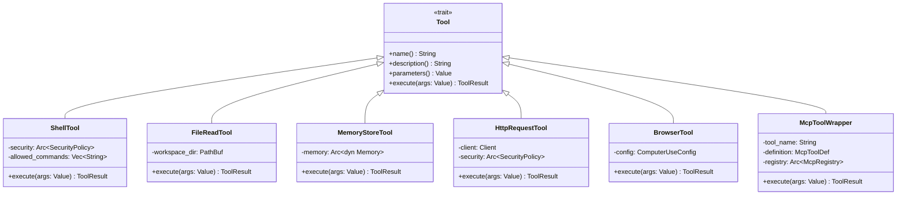
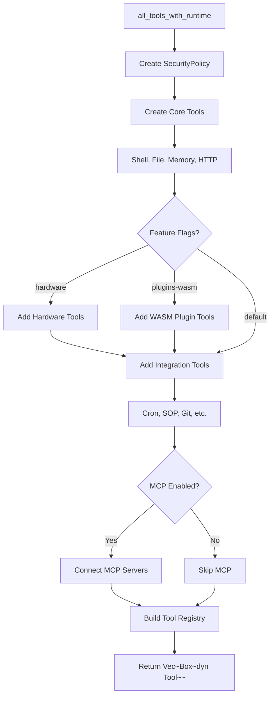
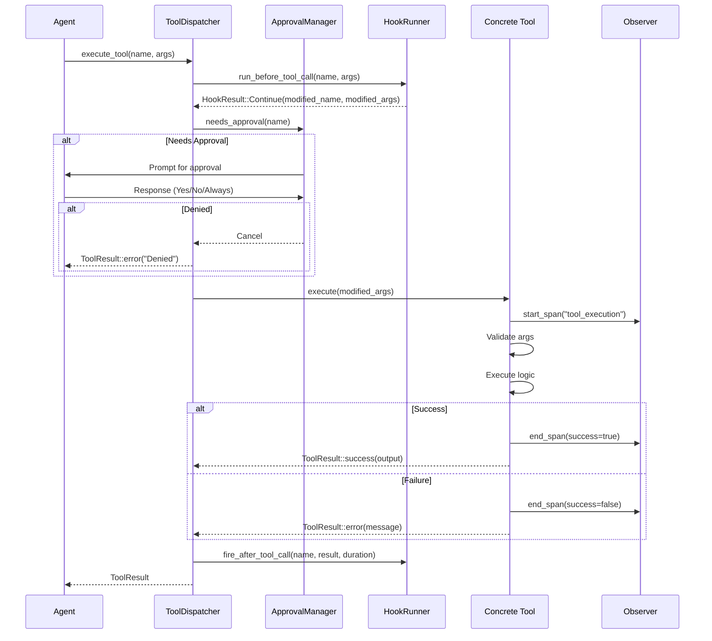

# Tools 模块设计文档

## 1. 模块概述

Tools 模块是零爪系统中最庞大和最核心的子系统之一,提供了 Agent 可调用的各种能力。该模块实现了超过 90 种工具,涵盖文件操作、Shell 执行、记忆管理、网络请求、浏览器控制、硬件交互、SOP 执行等多个领域。

### 1.1 核心职责

- **工具抽象**: 定义统一的 `Tool` trait,所有工具必须实现
- **工具注册**: 组装和管理工具注册表,支持动态启用/禁用
- **安全执行**: 集成 SecurityPolicy 进行权限检查和风险评估
- **结果结构化**: 返回标准化的 `ToolResult`,包含成功/失败状态和元数据
- **工具发现**: 支持 CLI 工具自动发现和 MCP (Model Context Protocol) 集成
- **技能工具**: 将用户定义的 Skills 转换为可调用工具

### 1.2 工具分类

**核心工具** (Core):
- Shell 命令执行
- 文件读写和编辑
- 记忆存储和检索
- HTTP 请求

**集成工具** (Integrations):
- Cron 任务管理
- SOP 流程执行
- Git 操作
- Notion、Jira、LinkedIn 等第三方服务

**硬件工具** (Hardware, feature-gated):
- GPIO 读写
- 开发板信息查询
- 内存映射读取

**高级工具** (Advanced):
- 浏览器自动化 (Computer Use)
- 图像生成和信息提取
- PDF 阅读
- 内容搜索

**元工具** (Meta):
- 工具搜索和发现
- 模型切换和路由
- 会话管理
- 技能加载

## 2. 架构设计

### 2.1 Tool Trait

```rust
#[async_trait]
pub trait Tool: Send + Sync {
    /// 工具名称 (唯一标识符)
    fn name(&self) -> &str;
    
    /// 人类可读的描述
    fn description(&self) -> &str;
    
    /// JSON Schema 参数定义
    fn parameters(&self) -> serde_json::Value;
    
    /// 执行工具,返回结构化结果
    async fn execute(&self, args: serde_json::Value) -> ToolResult;
}
```

### 2.2 ToolResult 结构

```rust
pub struct ToolResult {
    pub success: bool,
    pub output: String,
    pub error: Option<String>,
    pub metadata: serde_json::Value,
}
```

### 2.3 类图



### 2.4 工具注册流程



## 3. 核心工具详解

### 3.1 ShellTool

**功能**: 执行系统 shell 命令

**安全机制**:
```rust
pub struct ShellTool {
    security: Arc<SecurityPolicy>,
    allowed_commands: Vec<String>,  // 白名单命令
}

// 执行前验证
async fn execute(&self, args: Value) -> ToolResult {
    let command = extract_command(&args)?;
    
    // 1. 检查风险级别
    let risk = self.security.assess_command_risk(&command);
    
    // 2. 检查白名单
    if !self.security.is_command_allowed(&command) {
        return ToolResult::error("Command not in allowlist");
    }
    
    // 3. 中等风险需要审批
    if risk == RiskLevel::Medium && !approved {
        return ToolResult::error("Requires explicit approval");
    }
    
    // 4. 高风险直接拒绝
    if risk == RiskLevel::High {
        return ToolResult::error("High-risk command blocked");
    }
    
    // 5. 执行命令
    execute_shell_command(&command).await
}
```

**参数示例**:
```json
{
  "command": "ls -la",
  "cwd": "/tmp",
  "timeout_secs": 30
}
```

### 3.2 FileReadTool / FileWriteTool

**功能**: 安全地读写工作区内的文件

**安全限制**:
- 只能访问 `workspace_dir` 及其子目录
- 禁止访问隐藏文件 (`.env`, `.git/config` 等)
- 文件大小限制 (默认 10MB)
- Write 操作需要确认

**FileEditTool** (智能编辑):
- 支持 search/replace 块编辑
- 自动检测编码
- 保持文件格式化

### 3.3 MemoryStoreTool / MemoryRecallTool

**功能**: 与记忆系统交互

**MemoryStoreTool**:
```json
{
  "key": "user-preferences",
  "value": {"theme": "dark", "language": "zh-CN"},
  "category": "preferences",
  "ttl_hours": 720
}
```

**MemoryRecallTool**:
```json
{
  "query": "user preferences",
  "category": "preferences",
  "limit": 5,
  "strategy": "hybrid"  // keyword, vector, hybrid
}
```

### 3.4 HttpRequestTool

**功能**: 发送 HTTP 请求

**安全特性**:
- URL 白名单/黑名单
- 禁止内网地址 (SSRF 防护)
- 请求超时控制
- 响应大小限制
- Redirect 跟随限制

**参数示例**:
```json
{
  "method": "GET",
  "url": "https://api.example.com/data",
  "headers": {"Authorization": "Bearer token"},
  "body": null,
  "timeout_secs": 10
}
```

### 3.5 BrowserTool (Computer Use)

**功能**: 浏览器自动化,支持截图、点击、输入等操作

**依赖**: Playwright 或 Puppeteer

**操作类型**:
```json
{
  "action": "click",
  "selector": "#submit-button",
  "screenshot": true
}
```

支持的 actions:
- `navigate`: 导航到 URL
- `click`: 点击元素
- `type`: 输入文本
- `screenshot`: 截图
- `extract`: 提取页面内容

### 3.6 DelegateTool

**功能**: 将任务委托给子 Agent

**使用场景**:
- 并行处理多个子任务
- 专业化子 Agent (如代码审查、数据分析)
- 长时间运行的后台任务

**参数示例**:
```json
{
  "agent_name": "code-reviewer",
  "task": "Review the changes in PR #123",
  "context": {...},
  "allowed_tools": ["file_read", "git_operations"],
  "background": true
}
```

## 4. MCP (Model Context Protocol) 集成

### 4.1 概述

MCP 允许零爪连接到外部的 MCP 服务器,动态获取工具和资源。

### 4.2 架构组件

```
McpRegistry          - 管理所有 MCP 连接
McpToolWrapper       - 将 MCP 工具包装为零爪 Tool trait
McpTransport         - 传输层 (stdio, SSE, WebSocket)
McpProtocol          - MCP 协议解析和序列化
```

### 4.3 配置示例

```toml
[mcp]
enabled = true
deferred_loading = true  # 延迟加载,仅在使用时激活

[[mcp.servers]]
name = "filesystem"
command = "npx"
args = ["-y", "@modelcontextprotocol/server-filesystem", "/workspace"]

[[mcp.servers]]
name = "github"
command = "npx"
args = ["-y", "@modelcontextprotocol/server-github"]
env = { GITHUB_TOKEN = "..." }
```

### 4.4 延迟加载策略

```rust
// deferred_loading = true 时
1. 启动时只创建工具 stub
2. 首次调用时激活真实工具
3. 激活后缓存,后续调用直接使用

// 优点:
// - 快速启动
// - 减少资源占用
// - 按需加载
```

## 5. CLI 工具发现

### 5.1 概述

自动扫描 PATH 中的可执行文件,将其注册为可用工具。

### 5.2 发现流程

```rust
pub fn discover_cli_tools(
    include_patterns: &[String],
    exclude_patterns: &[String],
) -> Vec<CliToolInfo>
```

**步骤**:
1. 遍历 PATH 中的所有目录
2. 检查每个文件是否可执行
3. 运行 `--help` 或 `--version` 获取信息
4. 根据 include/exclude 模式过滤
5. 分类 (development, system, networking 等)

### 5.3 工具信息

```rust
pub struct CliToolInfo {
    pub name: String,
    pub path: PathBuf,
    pub category: String,
    pub version: Option<String>,
    pub description: Option<String>,
}
```

## 6. 技能工具 (Skill Tools)

### 6.1 概述

将用户在 Skills 中定义的工具转换为可调用的 Tool trait 对象。

### 6.2 转换逻辑

```rust
pub fn skills_to_tools(
    skills: &[Skill],
    security: Arc<SecurityPolicy>,
) -> Vec<Box<dyn Tool>>
```

**支持的 Skill Tool Kinds**:
- `shell`: 转换为 `SkillShellTool`
- `http`: 转换为 `SkillHttpTool`
- `script`: 转换为 `SkillShellTool` (执行脚本)

### 6.3 SkillShellTool

```rust
pub struct SkillShellTool {
    skill_name: String,
    tool_def: SkillTool,
    security: Arc<SecurityPolicy>,
}

// 执行时:
// 1. 从 SkillTool 获取命令模板
// 2. 替换参数占位符
// 3. 通过 SecurityPolicy 验证
// 4. 执行 shell 命令
```

## 7. 工具执行流程

### 7.1 完整执行链路



### 7.2 错误处理

**ToolResult 错误格式**:
```rust
ToolResult {
    success: false,
    output: String::new(),
    error: Some("Detailed error message".to_string()),
    metadata: json!({
        "error_code": "PERMISSION_DENIED",
        "tool_name": "shell",
        "duration_ms": 5
    }),
}
```

**常见错误类型**:
- `VALIDATION_ERROR`: 参数验证失败
- `PERMISSION_DENIED`: 安全策略阻止
- `EXECUTION_FAILED`: 工具执行出错
- `TIMEOUT`: 执行超时
- `NOT_FOUND`: 资源不存在

## 8. 扩展新工具

### 8.1 步骤

1. **创建新模块**: `src/tools/my_tool.rs`

2. **实现 Tool trait**:
```rust
use crate::tools::traits::{Tool, ToolResult};
use async_trait::async_trait;
use serde_json::Value;

pub struct MyTool;

#[async_trait]
impl Tool for MyTool {
    fn name(&self) -> &str {
        "my_tool"
    }

    fn description(&self) -> &str {
        "Description of what this tool does"
    }

    fn parameters(&self) -> Value {
        serde_json::json!({
            "type": "object",
            "properties": {
                "param1": {
                    "type": "string",
                    "description": "First parameter"
                }
            },
            "required": ["param1"]
        })
    }

    async fn execute(&self, args: Value) -> ToolResult {
        let param1 = args.get("param1")
            .and_then(|v| v.as_str())
            .ok_or_else(|| "Missing param1")?;
        
        // Implement logic here
        
        ToolResult::success(format!("Result: {}", param1))
    }
}
```

3. **在 mod.rs 中注册**:
```rust
pub mod my_tool;
pub use my_tool::MyTool;

// 在 all_tools_with_runtime 中添加
tools.push(Box::new(MyTool));
```

4. **添加测试**:
```rust
#[cfg(test)]
mod tests {
    use super::*;
    
    #[tokio::test]
    async fn test_my_tool() {
        let tool = MyTool;
        let args = serde_json::json!({"param1": "test"});
        let result = tool.execute(args).await;
        assert!(result.success);
    }
}
```

### 8.2 最佳实践

**安全性**:
- 始终验证输入参数
- 遵循最小权限原则
- 记录所有敏感操作

**性能**:
- 异步执行 I/O 操作
- 设置合理的超时时间
- 避免阻塞操作

**可维护性**:
- 清晰的工具名称和描述
- 详细的参数文档
- 全面的错误消息

**用户体验**:
- 提供有用的输出
- 支持渐进式披露 (复杂工具提供示例)
- 考虑国际化 (错误消息多语言)

## 9. 工具分类统计

| 类别 | 数量 | 示例 |
|------|------|------|
| 文件系统 | 5 | file_read, file_write, file_edit, glob_search, backup |
| Shell/进程 | 3 | shell, cli_discovery, codex_cli |
| 记忆管理 | 5 | memory_store, memory_recall, memory_forget, memory_purge, memory_export |
| 网络/HTTP | 4 | http_request, web_fetch, web_search, proxy_config |
| 浏览器 | 4 | browser, browser_open, screenshot, text_browser |
| Cron 调度 | 6 | cron_add, cron_list, cron_remove, cron_run, cron_runs, cron_update |
| SOP 流程 | 5 | sop_list, sop_execute, sop_approve, sop_advance, sop_status |
| Git/版本控制 | 1 | git_operations |
| 第三方集成 | 8 | notion, jira, linkedin, google_workspace, microsoft365, pushover, discord_search, composio |
| 硬件 (feature) | 3 | hardware_board_info, hardware_memory_map, hardware_memory_read |
| 元工具 | 10 | delegate, model_switch, tool_search, read_skill, sessions_*, escalate, ask_user, reaction |
| AI/ML | 4 | image_gen, image_info, llm_task, knowledge_tool |
| MCP | 4 | mcp_client, mcp_tool, mcp_deferred, mcp_transport |
| 其他 | 10+ | calculator, weather, pdf_read, cloud_ops, swarm, canvas, etc. |

**总计**: 90+ 工具

## 10. 性能优化

### 10.1 工具缓存

- **MCP 工具**: 延迟加载后缓存
- **CLI 工具**: 启动时扫描,缓存结果
- **Skill 工具**: 解析后缓存

### 10.2 并发控制

- **工具执行**: 异步执行,不阻塞主循环
- **资源限制**: 限制并发工具执行数量
- **超时控制**: 每个工具设置独立超时

### 10.3 内存管理

- **大文件处理**: 流式读取,避免全部加载到内存
- **响应截断**: 过长的输出自动截断
- **结果压缩**: 可选的结果压缩存储

## 11. 安全考虑

### 11.1 防御层次

```
Layer 1: Tool-level validation (参数验证)
Layer 2: SecurityPolicy (权限检查)
Layer 3: ApprovalManager (人工审批)
Layer 4: Sandbox (隔离执行,可选)
Layer 5: Audit logging (审计日志)
```

### 11.2 常见攻击面

**Shell Injection**:
- 防止: 参数化命令,避免字符串拼接
- 示例: 使用 `Command::new("ls").arg(path)` 而非 `Command::new(&format!("ls {}", path))`

**Path Traversal**:
- 防止: 规范化路径,检查工作区边界
- 示例: `path.starts_with(&workspace_dir)`

**SSRF (Server-Side Request Forgery)**:
- 防止: URL 白名单,禁止内网地址
- 示例: 检查 IP 是否在 `10.0.0.0/8`, `192.168.0.0/16` 等范围

**Resource Exhaustion**:
- 防止: 文件大小限制,执行超时,内存限制
- 示例: `timeout_secs: 30`, `max_file_size: 10MB`

## 12. 调试和监控

### 12.1 工具执行追踪

```bash
# 查看最近的工具执行
zeroclaw doctor traces --event tool_call --limit 10

# 查看特定工具的详细追踪
zeroclaw doctor traces --contains "shell" --limit 5
```

### 12.2 指标收集

通过 Observability 模块收集:
- 工具调用次数
- 成功率/失败率
- 平均执行时间
- 错误分布

### 12.3 日志级别

```rust
tracing::info!(tool = "shell", command = %cmd, "Executing shell command");
tracing::warn!(tool = "http", url = %url, "Request timeout");
tracing::error!(tool = "file_write", path = %path, error = %e, "Write failed");
```

## 13. 相关模块

- **Agent 模块**: 调用工具执行
- **Security 模块**: 提供安全策略验证
- **Approval 模块**: 处理工具执行审批
- **Hooks 模块**: 工具执行前后钩子
- **Observability 模块**: 工具执行追踪和指标
- **Skills 模块**: 定义用户自定义工具
- **Plugins 模块**: WASM 插件工具
- **Cron 模块**: Cron 管理工具
- **SOP 模块**: SOP 执行工具

## 14. 未来方向

### 14.1 计划中的改进

1. **工具组合**: 支持原子性的多工具事务
2. **工具推荐**: 基于上下文智能推荐工具
3. **工具学习**: 从历史执行中学习最佳实践
4. **可视化调试**: Web UI 中的工具执行可视化
5. **工具市场**: 社区共享的自定义工具

### 14.2 研究中的特性

- **自适应工具选择**: RL-based tool selection
- **工具执行预测**: 预测工具执行结果,提前优化
- **跨工具上下文传递**: 智能的工具链上下文管理
