# ZeroClaw 架构图

本文档提供 ZeroClaw 架构、执行模式和数据流的可视化表示。

---

## 1. 执行模式

**ZeroClaw 的运行方式：**

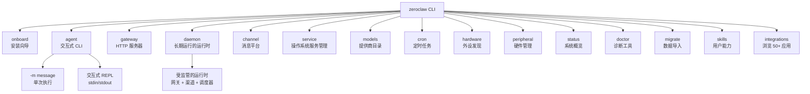

---

## 2. 系统架构概览

**高级组件结构：**

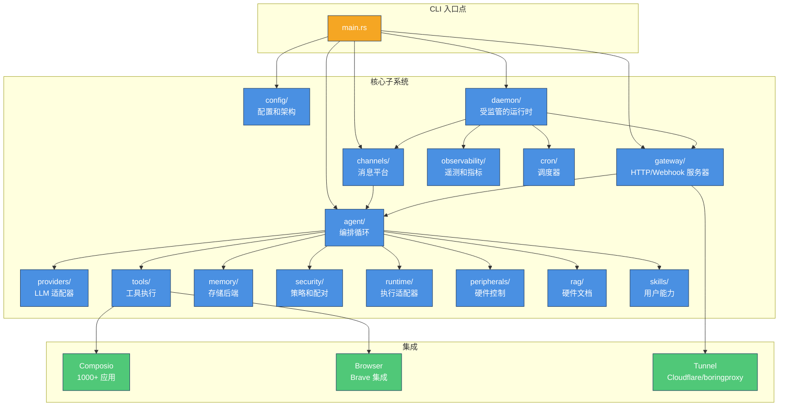

---

## 3. 消息流经系统

**用户消息如何变成响应：**

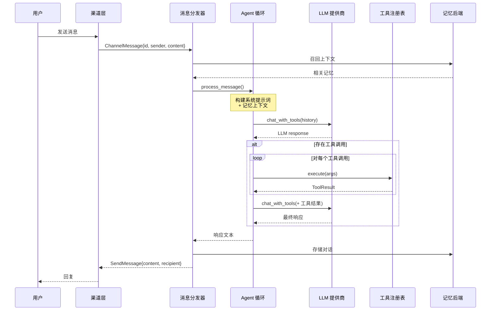

---

## 4. Agent 循环执行流程

**核心 Agent 编排循环：**

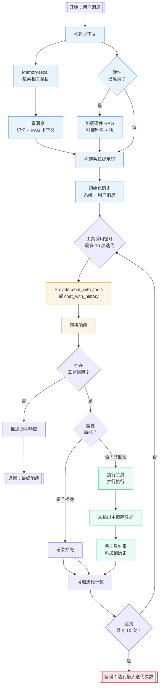

---

## 5. Daemon 监管模型

**Daemon 如何保持组件运行：**

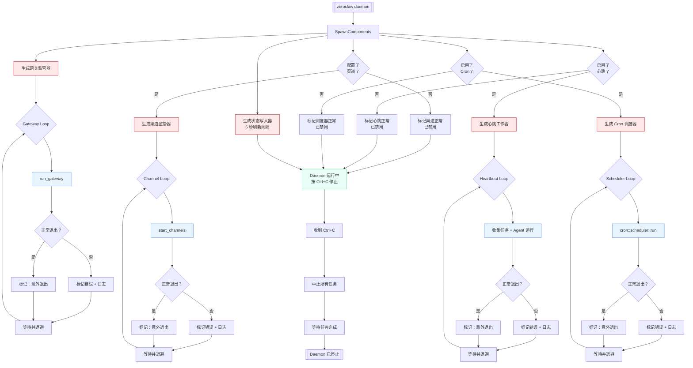

---

## 6. Gateway HTTP 端点

**网关的 HTTP API 结构：**

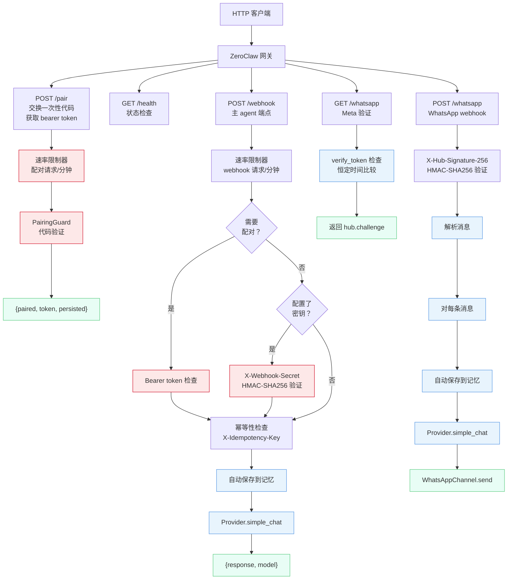

---

## 7. 渠道消息分发

**渠道如何将消息路由到 agent：**

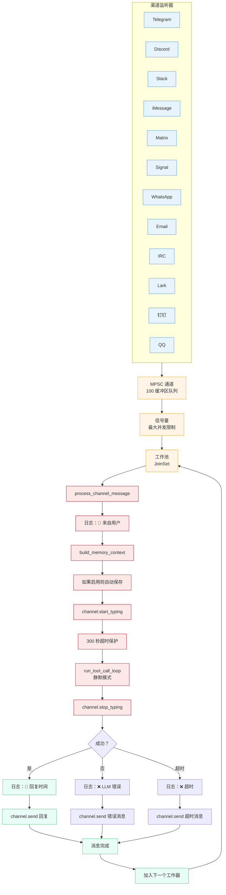

---

## 8. 记忆系统架构

**存储后端和数据流：**

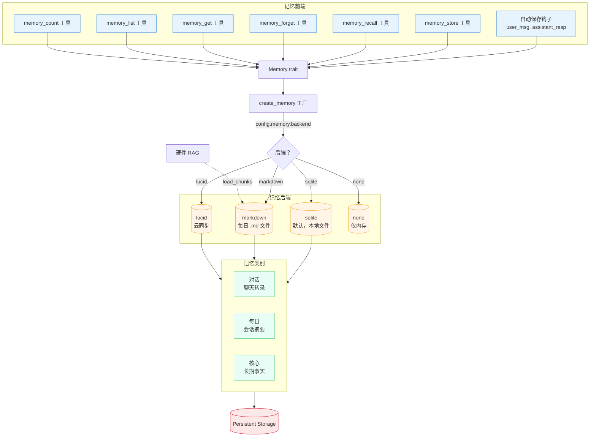

---

## 9. 提供商和模型路由

**LLM 提供商抽象和路由：**

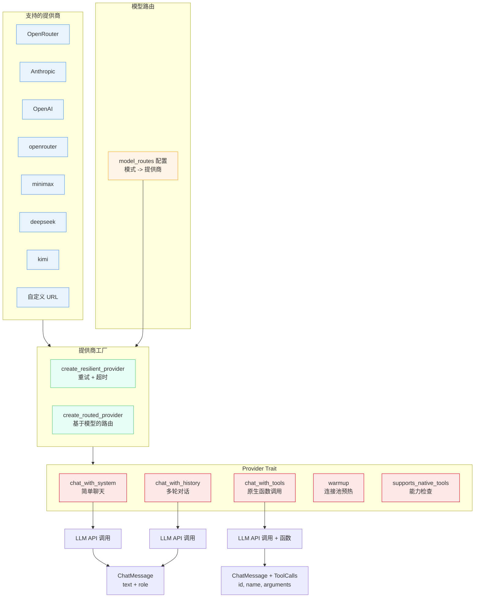

---

## 10. 工具执行架构

**工具注册表、执行和安全：**

```mermaid
flowchart TB
    subgraph ToolCategories[工具类别]
        Core[核心工具<br/>shell, file_read, file_write]
        Memory[记忆工具<br/>store, recall, forget]
        Schedule[调度工具<br/>cron_add, cron_list 等]
        Browser[浏览器<br/>Brave 集成]
        Composio[Composio<br/>1000+ 应用操作]
        Hardware[硬件<br/>gpio_read, gpio_write,<br/>arduino_upload 等]
        Delegate[委托<br/>子 agent 路由]
        Screenshot[screenshot<br/>屏幕捕获]
    end

    subgraph Registry[工具注册表]
        AllTools[all_tools_with_runtime<br/>工厂函数]
        DefaultTools[default_tools<br/>基础集]
        PeripheralTools[create_peripheral_tools<br/>硬件特定]
    end

    subgraph Security[安全策略]
        AllowedCmds[allowed_commands<br/>白名单]
        WorkspaceOnly[workspace_only<br/>路径限制]
        MaxActions[max_actions_per_hour<br/>速率限制]
        MaxCost[max_cost_per_day_cents<br/>成本上限]
        Approval[approval manager<br/>受监督的工具]
    end

    subgraph Execution[工具执行]
        Validate[输入验证<br/>架构检查]
        Approve{需要<br/>审批？}
        Execute[异步执行]
        Scrub[从输出中擦除凭据]
        Result[ToolResult<br/>success, output, error]
    end

    ToolCategories --> Registry
    Registry --> Security
    Security --> Execution

    Validate --> Approve
    Approve -->|是| Prompt[提示 CLI]
    Approve -->|否 / 已批准| Execute
    Approve -->|拒绝| Denied[返回拒绝]

    Prompt --> UserChoice{用户选择？}
    UserChoice -->|是| Execute
    UserChoice -->|否| Denied

    Execute --> Scrub
    Scrub --> Result
    Result --> Return[返回到 agent 循环]

    classDef tools fill:#E8F4FD,stroke:#4A90E2
    classDef registry fill:#FFF4E6,stroke:#F5A623
    classDef security fill:#FDE8E8,stroke:#D0021B
    classDef exec fill:#E8FDF5,stroke:#50C878

    class Core,Memory,Schedule,Browser,Composio,Hardware,Delegate,Screenshot tools
    class AllTools,DefaultTools,PeripheralTools registry
    class AllowedCmds,WorkspaceOnly,MaxActions,MaxCost,Approval security
    class Validate,Approve,Prompt,Execute,Scrub,Result,Return exec
```

---

## 11. 配置加载

**配置如何加载和合并：**

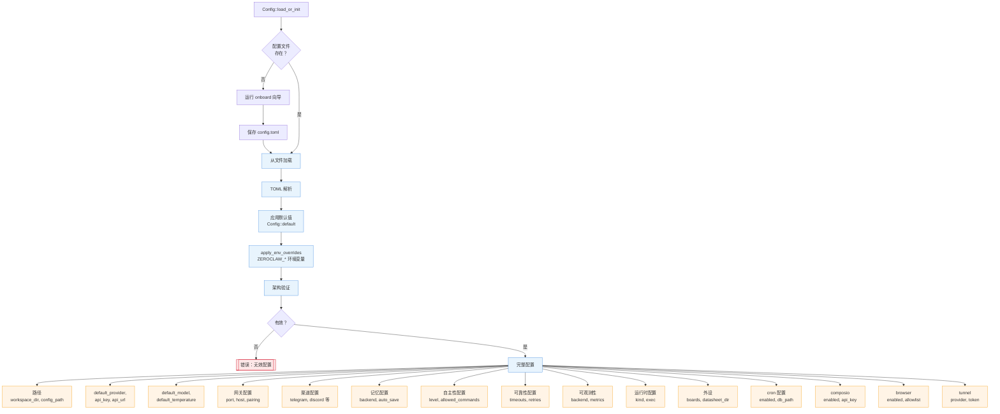

---

## 12. 硬件外设集成

**硬件板支持和控制：**

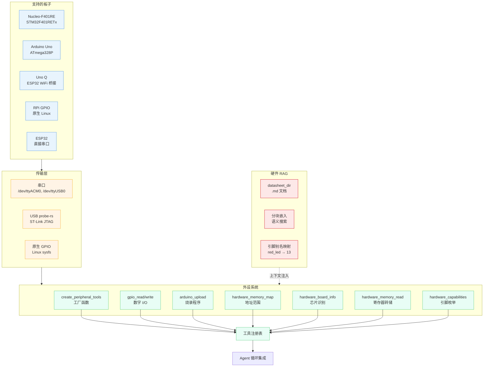

---

## 13. 可观测事件

**遥测和可观测性流：**

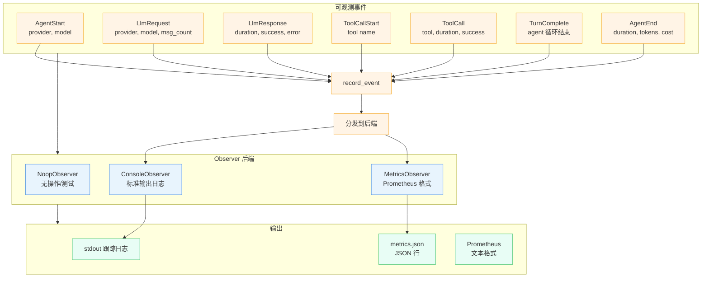

---

## 总结图

**快速参考概览：**

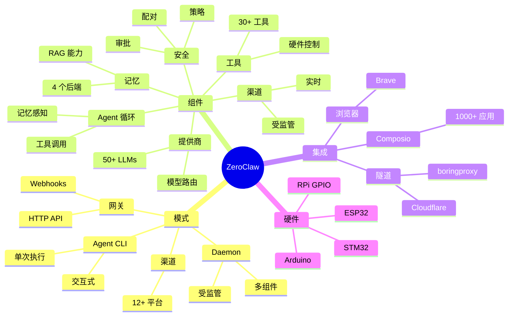

---

*为 ZeroClaw v0.1.0 生成 - 架构文档*
